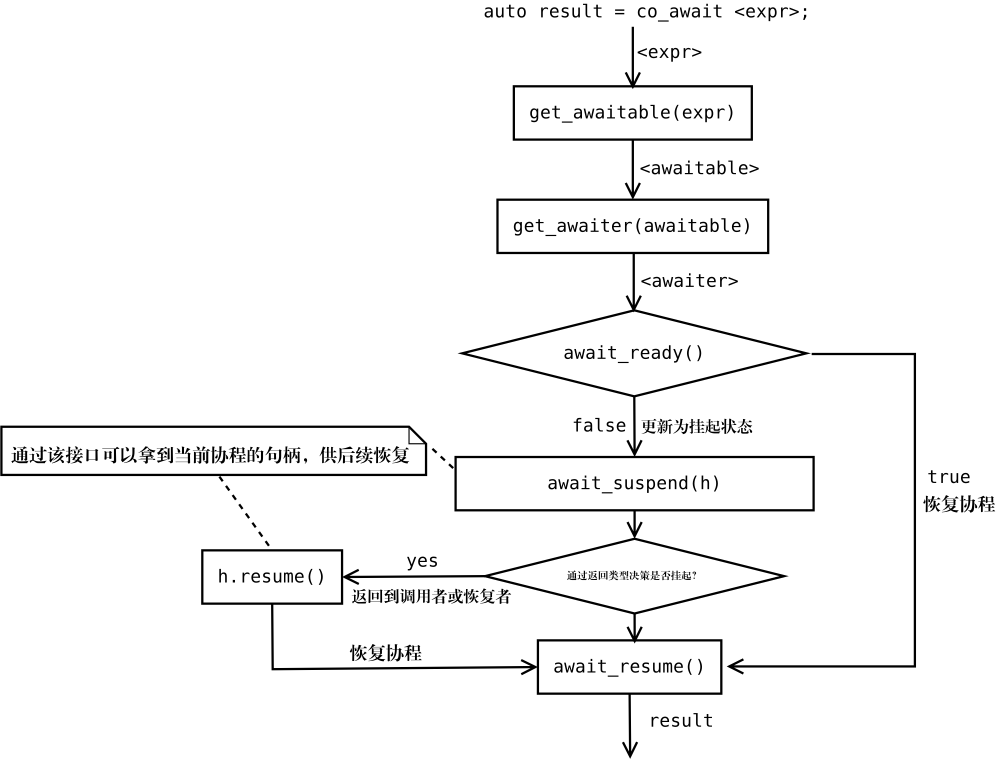

= C++高级编程
:customcss: ../presentation.css
:revealjsdir: https://cdn.jsdelivr.net/npm/reveal.js@3.9.2
:revealjs_plugins: ../presentation_plugins.js
:revealjs_plugins_configuration: ../presentation_plugins_conf.js
:revealjs_theme: serif
:highlightjs-theme: https://cdn.jsdelivr.net/npm/highlight.js@10.2.1/styles/github-gist.css
:highlightjs-languages: cpp
:source-highlighter: highlightjs
:revealjs_history: true
:revealjs_pdfseparatefragments: false
:revealjs_transition: slide
:revealjs_slideNumber: c/t
:revealjs_fragmentInURL: true
:icons: font
:stem:
Netcan {docdate} @Shanghai

include::../common/self_introduction.adoc[]

== 议程
* C++的特点
* C++特性的演进
* C++20核心特性精讲
** 概念约束
** ranges标准库
** 无栈协程
** 模块

== C++的特点
* 易于上手、难于精通、资料丰富
* 贴近硬件、抽象手段丰富、零开销抽象
* 表达力强、简洁，多范式编程
* 编译时计算能力

== C++特性演进：标准库容器
C++98:

[source,cpp]
----
std::vector<int> v;
v.push_back(1); v.push_back(2);
v.push_back(3); v.push_back(4);
----

C++11初始化列表:

[source,cpp]
----
std::vector<int> v { 1, 2, 3, 4 };
----

C++17类模板参数推导:

[source,cpp]
----
std::vector v { 1, 2, 3, 4 };
----

== C++特性演进：迭代循环与auto
C++98:

[source,cpp]
----
for (vector<thread>::iterator it = vec.begin(); it != vec.end(); ++it)
    it->join();

std::for_each(vec.begin(), vec.end(), mem_fun_ref(&thread::join));
----

C++11 基于范围循环:
[source,cpp]
----
for (auto& th: vec) th.join();
----

C++17 结构体绑定:
[source,cpp]
----
for (auto& [key, value]: kvMap) /* ... */
----

C++20 初始化与基于范围循环：
[source,cpp]
----
for(auto obj = GetObj(); auto& item: obj.GetCollection()) /* ... */
----

== C++特性演进：仿函数与lambda
C++98:
[source,cpp]
----
struct Finder { // 无趣的仿函数类
  bool operator() (int x) const { return e_ == x; }
  int e_;
};
Finder finder = { x };
vector<int>::iterator it = find_if(v.begin(), v.end(), finder);
----

C++11:
[source,cpp]
----
auto it = find_if(v.begin(), v.end(), [e](int x) { return x == e; });
----

C++20:
[source,cpp]
----
auto f = []<typename>() {};
----

== C++特性演进：移动语义（右值）
C++98拷贝构造:
[source,cpp]
----
Obj f();
Obj o = f(); // 拷贝构造（关闭RVO优化）
----

C++11移动构造:
[source,cpp]
----
Obj o = f(); // 移动构造（关闭RVO优化）
----

C++17拷贝消除:
[source,cpp]
----
Obj o = f(); // 标准化：省略掉拷贝、移动动作
----

== C++特性演进：移动语义（左值）
C++98表达移动语义:

[source,cpp]
----
std::vector<int> v2;
v2.swap(v1);
----

C++11表达移动语义:

[source,cpp]
----
std::vector<int> v2{ std::move(v1) };
----

通过引入右值 `&&` 来匹配移动构造：
[source,cpp]
----
vector(vector&& rhs) noexcept {
  begin_ = rhs.begin_;
  end_ = rhs.end_;
  end_cap_ = rhs.end_cap_;
  rhs.begin_ = rhs.end_ = rhs.end_cap_ = nullptr;
}
----

== C++特性演进：可变参数、折叠表达式
[source,cpp]
----
print(1, 2, "3", 4.0);
----

C++11 可变参数：
[source,cpp]
----
void print() { }

template<typename A, typename... Args>
void print(const A& arg, const Args&... args) {
    std::cout << arg << std::endl;
    print(args...); // 递归与参数包展开
}
----

C++17 折叠表达式：

[source,cpp]
----
template<typename... Args>
void print(const Args&... args) {
    ((std::cout << args << std::endl), ...); // 逗号表达式、折叠表达式
}
----

C++20 auto函数参数：
[source,cpp]
----
void print(const auto&... args) {
    ((std::cout << args << std::endl), ...);
}
----

== C++20核心特性：概念约束

编译期谓词，它根据程序员定义的接口规范对类型、常量等进行 [.blue]*编译时检查*，以便在泛型编程中提供更好的 [.blue]*可读性与错误信息*。

[source,cpp]
----
template<typename T> // 配合requires表达式，定义概念
concept Addable = requires(T a, T b) {
    a + b;
};

// 使用概念约束
template<Addable E>
Addable auto add(E e1, E e2) {
    return e1 + e2;
}

add(1, 2); // ok
add(obj, obj); // condidate template ignored: constraints not satisfied [with E = Obj]
               // because 'Obj' does not satisfy 'Addable'
----

== C++20核心特性：概念约束
concept定义
[source,cpp]
----
template <被约束的模板参数列表>
concept 概念名 = 约束表达式;
// concept合取
template <typename T>
concept unsigned_integral = std::integral<T> && !std::signed_integral<T>;
// concept析取
template<typename T>
concept integral_or_floating = std::integral<T> || std::floating_point<T>;
----

requires表达式：
[source,cpp]
----
template<typename T>
requires (T x) {
    x++;
    typename T::value_type;
    {*x} noexcept -> std::same_as<typename T::value_type>;
    requires Addable<T>;
};
----

== C++20核心特性：概念约束
* 基础特性、面向普通用户
* 强大的泛化、表达力
* 静态检查，相对于手写代码做到零成本开销
* 替代传统惯用法：`enable_if` 与标签分发技术

== C++20核心特性：ranges标准库
对现有的标准库进行了补充，它以 [.blue]*函数式编程范式* 进行编程，将计算任务由一系列 [.blue]*原子* 操作灵活 [.blue]*组合* 而成，使得代码的正确性更 [.blue]*容易推理*。

Unix哲学：
[source]
----
$ find tex/ -type f -name "*.tex" | xargs wc -m \
                                  | awk '{if ($1 > 200) {print $0}}' \
                                  | sort -n
   228 tex/constexpr-metaprogramming.tex
  1396 tex/foreword.tex
  1551 tex/ranges.tex
  3582 tex/template-metaprogramming.tex
 10916 tex/metaprogramming-introduction.tex
 58032 tex/concept-constraint.tex
 58330 tex/compiletime-polymorphism.tex
 64871 tex/type-and-object.tex
199090 total
----

== C++20核心特性：ranges标准库
[source,cpp]
----
auto res = views::iota(1) // 生成[1,)的无穷数列
    | views::transform ( { return n * n;      })
    | views::filter    ( { return n % 2 == 1; })
    | views::take_while( { return n < 10000;  })
    ;
std::cout << sum(res) << std::endl; // 166650
----

== C++20核心特性：ranges标准库
* 延迟计算、灵活组合
* 避免手写丑陋的循环、分支、嵌套代码
* 编译器可能基于原子组合的假设生成最为高效代码

== C++20核心特性：无栈协程
[.blue]*可挂起可恢复* 的 [.blue]*通用函数*，它的切换开销是纳秒级的，相对其他方案而言占用极低的资源，并且可以 [.blue]*非侵入式* 地为已有库扩展协程接口。

典型应用场景：并发编程、生成器、流处理、异常处理

[source,cpp]
----
Task<> handle_echo(Stream stream) {
  while (true) {
    auto data = co_await stream.read(200);
    if (data.empty()) { break; }
    co_await stream.write(data);
  }
  stream.close();
}

Task<> echo_server() {
  auto server = co_await asyncio::start_server(handle_echo, "127.0.0.1", 8888);
  co_await server.serve_forever();
}

int main() {
  asyncio::run(echo_server());
}
----

== C++20核心特性：无栈协程

`co_await` 表达式是无栈协程的核心，它表达了一个潜在的切换点。

库开发者通过实现 `co_await` 所需要的一系列接口，定制协程的控制流。

== C++20核心特性：无栈协程
* 轻量级
* 以同步的方式编写异步代码
* 容易扩展

== C++20核心特性：模块
解决了传统上头文件编译模型的痛点：

* 依赖顺序导致头文件难以组合、重复地解析、符号覆盖等问题
* 语言层面为程序员提供了 [.blue]*模块化* 的手段
* 编译性能大幅提升

[source,cpp]
----
import std.core; // 导入标准库模块，需要C++23
int main() {
    std::cout << "Hello world" << std::endl;
}
----

== C++20核心特性：模块
模块接口文件
[source,cpp]
----
module; // 可选，全局模块片段
// 在这个片段中导入需要的头文件，它们仅仅是实现所需，并不属于模块的一部分
// 它们对模块的其他文件也不可见

export module 模块名; // 必要的，表达模块接口部分
// 模块名可以包含句点.，通常可以表达组织关系、子模块等
// 这部分可以通过import导入其他所需的模块，这些被导入的实体对该模块的所有文件可见
// 可以使用export修饰需要导出的函数、类等实体
// 未使用export修饰的实体同样对该模块的所有文件可见

module :private; // 可选，私有片段
// 如果使用私有片段，则模块仅由该接口文件组成，这部分为接口文件的实现部分
----

模块实现文件
[source,cpp]
----
module; // 可选，全局模块片段

module 模块名; // 必要的，表达模块的实现部分
// 在这实现，它对应的模块接口所声明的实体将隐式地导入
----

== C++20核心特性：模块
* 兼容传统头文件模型
* 模块化
* 高效编译

== 参考资料
* 机工社 https://item.jd.com/10054930586115.html[《C++20高级编程》]

[state=thank]
== Thank you!

[state=thank]
== Question?

