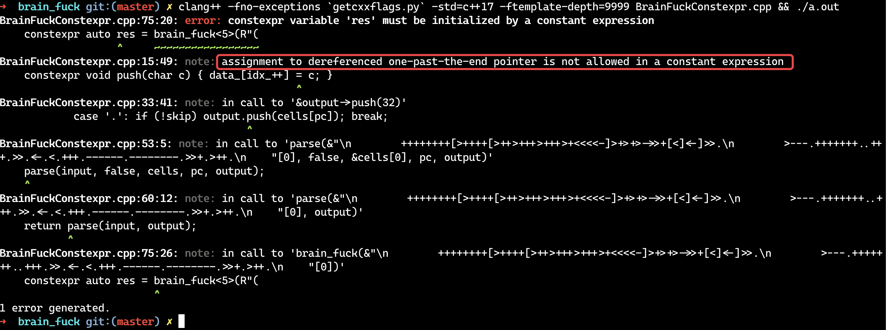
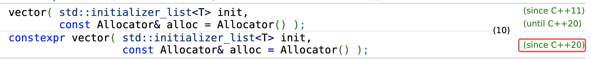
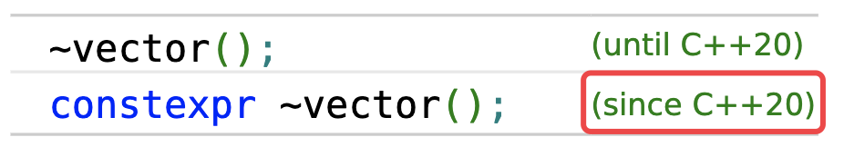
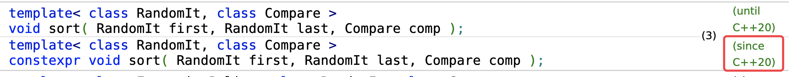

= CONSTEXPR 从 11 到 20
:customcss: ../presentation.css
:revealjsdir: ../node_modules/reveal.js
:revealjs_plugins: ../presentation_plugins.js
:revealjs_plugins_configuration: ../presentation_plugins_conf.js
:revealjs_theme: serif
:highlightjs-theme: https://cdn.jsdelivr.net/npm/highlight.js@10.2.1/styles/github-gist.css
:source-highlighter: highlightjs
:highlightjs-languages: cpp,x86asm,haskell
:revealjs_history: true
:revealjs_pdfseparatefragments: false
:revealjs_transition: slide
:revealjs_slideNumber: c/t
:revealjs_fragmentInURL: true
:icons: font
:stem:
Netcan {docdate} @Shanghai

[subtitle]#constexpr auto 😀#

template metaprogramming is dead +
long live constexpr

include::../common/self_introduction.adoc[]

== 议程
* 编译时计算（元编程）
* 演进历史
* constexpr vs 模板元
* 深入constexpr
* 应用
* 展望未来
* 结论

== 编译时计算（元编程）
* 零成本抽象
* 编译时多态 (eg. Policy Class, Tag Dispatcher, CRTP)
* 值计算
* 类型计算(Type Traits)
* 类型安全 (eg. 单位运算, Phantom Types)
* 内部领域特定语言(EDSL)

=== 编译时计算（元编程）& 风格
* 模板元编程
* Constexpr all the things!
* 两者结合

[.columns]
== 演进历史
[.column]
--
模板元编程

* 1986 C++引入模板
* C++98 模板实例化
* C++11 模板类别名、可变模板参数、static_assert、decltype、type_traits
* C++14 decltype(auto)、integer_sequence
* C++17 类模板参数推导CTAD、auto非类型参数、void_t
* C++20 概念Concept、放宽非类型参数
--

[.column]
--
constexpr

* C++11 引入constexpr简单函数
* C++14 放开constexpr约束, 模板变量
* C++17 if constexpr、constexpr lambda、折叠表达式
* C++20 constexpr容器、constexpr new、constexpr析构函数、constexpr虚函数、consteval/constinit、lambda模板参数
* constexpr STL algorithms
--

[.columns]
== constexpr vs 模板元编程
[.column]
--
BrainFuck语言

* 图灵完备
* 8种操作符
* DSL

https://fatiherikli.github.io/brainfuck-visualizer/#PisrKysrKysrWzwrKysrKysrKys+LV08LiAgICAgICAgICAgICAgICAgOyBICj4+KysrKysrKysrK1s8KysrKysrKysrKz4tXTwrLiAgICAgICAgICAgIDsgZQo+PisrKysrKysrK1s8KysrKysrKysrKysrPi1dPC4gICAgICAgICAgICA7IGwKPj4rKysrKysrKytbPCsrKysrKysrKysrKz4tXTwuICAgICAgICAgICAgOyBsCj4+KysrKysrKysrK1s8KysrKysrKysrKys+LV08Ky4gICAgICAgICAgIDsgbwo+PisrKytbPCsrKysrKysrPi1dPC4gICAgICAgICAgICAgICAgICAgICA7Cj4+KysrKysrKysrKytbPCsrKysrKysrPi1dPC0uICAgICAgICAgICAgIDsgVwo+PisrKysrKysrKytbPCsrKysrKysrKysrPi1dPCsuICAgICAgICAgICA7IG8KPj4rKysrKysrKysrWzwrKysrKysrKysrKys+LV08LS0tLS0tLiAgICAgOyByCj4+KysrKysrKysrWzwrKysrKysrKysrKys+LV08LiAgICAgICAgICAgIDsgbAo+PisrKysrKysrKytbPCsrKysrKysrKys+LV08LiAgICAgICAgICAgICA7IGQKPj4rKysrKytbPCsrKysrKz4tXTwtLS0uICAgIC[brainfuck-visualizer]
--

[.column]
--
[cols="2"]
|===
| > |	++ptr;
| < |	--ptr;
| + |	++*ptr;
| - |	--*ptr;
| . |	putchar(*ptr);
| , |	*ptr = getchar();
| [ |	while (*ptr) {
| ] |	}

|===
--

=== BrainFuck: Hello world
[source,cpp]
----
puts( R"(
    >++++++++[<+++++++++>-]<.             ; H   (8*9     = 72)
    >>++++++++++[<++++++++++>-]<+.        ; e   (10*10+1 = 101)
    >>+++++++++[<++++++++++++>-]<.        ; l   (9*12    = 108)
    >>+++++++++[<++++++++++++>-]<.        ; l   (9*12    = 108)
    >>++++++++++[<+++++++++++>-]<+.       ; o   (10*11+1 = 111)
    >>++++[<++++++++>-]<.                 ; ' ' (4*8     = 32)
    >>+++++++++++[<++++++++>-]<-.         ; W   (11*8-1  = 87)
    >>++++++++++[<+++++++++++>-]<+.       ; o   (10*11+1 = 111)
    >>++++++++++[<++++++++++++>-]<------. ; r   (10*12-6 = 114)
    >>+++++++++[<++++++++++++>-]<.        ; l   (9*12    = 108)
    >>++++++++++[<++++++++++>-]<.         ; d   (10*10   = 100)
    >>++++++[<++++++>-]<---.              ; !   (6*6-3   = 33)
)"_brain_fuck );
----

== BrainFuck编译器：模板元解法
基础元数据结构
[source,cpp]
----
template<char c>
using Cell = std::integral_constant<char, c>;

template<size_t P = 0, bool INLOOP = false, typename ...CELLs>
struct Machine {
    using type = Machine<P, INLOOP, CELLs...>;
    constexpr static bool InLoop = INLOOP;
};
----

=== BrainFuck编译器：模板元解法
相关操作
[source,cpp,subs="verbatim,quotes"]
----
namespace MachineTrait {
    template<size_t N>
    struct *InitMachine*: Concat_t<Machine<0, 0, Cell<0>>, typename *InitMachine<N-1>*::type> {};
    template<> struct *InitMachine<0>: Machine<0, 0, Cell<0>>* {};

    template<typename MACHINE> struct Inc;
    template<typename MACHINE> using Inc_t = typename Inc<MACHINE>::type;
    template<size_t PC, bool INLOOP, typename C, typename... CELLs>
    struct Inc<Machine<PC, INLOOP, C, CELLs...>>:
        Concat_t<Machine<PC, INLOOP, C>, Inc_t<Machine<PC - 1, INLOOP, CELLs...>>> {};
    template<bool INLOOP, typename C, typename... CELLs>
    struct Inc<Machine<0, INLOOP, C, CELLs...>>:
        Machine<0, INLOOP, Cell< *C::value + 1* >, CELLs...> {};

    template<typename MACHINE>
    struct Left;
    template<typename MACHINE>
    using Left_t = typename Left<MACHINE>::type;
    template<size_t PC, bool INLOOP, typename... CELLs>
    struct Left<Machine<PC, INLOOP, CELLs...>>:
        Machine< *PC-1*, INLOOP, CELLs...> {};
};
----

=== BrainFuck编译器：模板元解法
解析BrainFuck代码：基本操作
[source,cpp,subs="verbatim,quotes"]
----
template<typename MACHINE, bool skip, char ...cs>
struct BrainFuck: MACHINE {};
template<typename MACHINE, bool skip, char ...cs>
using BrainFuck_t = typename BrainFuck<MACHINE, skip, cs...>::type;

template<typename MACHINE, char ...cs>
struct BrainFuck<MACHINE, false, *'+'*, cs...>:
    BrainFuck_t<MachineTrait::Inc_t<MACHINE>, false, cs...> {};

template<typename MACHINE, char ...cs>
struct BrainFuck<MACHINE, false, *'-'*, cs...>:
    BrainFuck_t<MachineTrait::Dec_t<MACHINE>, false, cs...> {};

template<typename MACHINE, char ...cs>
struct BrainFuck<MACHINE, false, *'<'*, cs...>:
    BrainFuck_t<MachineTrait::Left_t<MACHINE>, false, cs...> {};

template<typename MACHINE, char ...cs>
struct BrainFuck<MACHINE, false, *'>'*, cs...>:
    BrainFuck_t<MachineTrait::Right_t<MACHINE>, false, cs...> {};
----

=== BrainFuck编译器：模板元解法
解析BrainFuck代码：循环 & 分支
[source,cpp,subs="verbatim,quotes"]
----
template<typename MACHINE, char ...cs>
struct BrainFuck<MACHINE, false, *'['*, cs...> {
    using EnableLoopedMachine = MachineTrait::EnableLoop_t<MACHINE>;

    template<typename IN, bool = MachineTrait::IsZero_t<IN>::value>
    struct Select: BrainFuck_t<IN, true, cs...> {}; // skip
    template<typename IN> // loop
    struct Select<IN, false>: BrainFuck_t<IN, false, cs...> {};

    using Result = typename Select<EnableLoopedMachine>::type;

    template<typename IN, bool = (! MachineTrait::IsZero_t<IN>::value && IN::InLoop)>
    struct Loop: IN {};   // skip
    template<typename IN> // continue
    struct Loop<IN, true>: BrainFuck_t<IN, false, '[', cs...> {};

    using type = typename Loop<Result>::type;
};
----

=== BrainFuck编译器：模板元解法
保存结果
[source,cpp]
----
template<size_t PC, bool INLOOP, typename ...CELLs>
inline const auto ToStr(Machine<PC, INLOOP, CELLs...>) {
    constexpr const static char str[] = { CELLs::value ...  };
    return str;
}

template<typename T, T... cs>
constexpr auto operator ""_brain_fuck() {
    using Machine = MachineTrait::InitMachine_t<15>;
    using Result = BrainFuck_t<Machine, false, cs...>;

    return ToStr(Result{});
};
----

=== BrainFuck编译器：模板元解法
完整代码： https://godbolt.org/z/GTKxhc[https://godbolt.org/z/GTKxhc]

生成代码
[source,x86asm,subs="verbatim,quotes"]
----
main:
    subq    $8, %rsp
    movl    $MachineTrait::ToStr<...>(Machine<...>)::str, %edi
    call    puts
    xorl    %eax, %eax
    addq    $8, %rsp
    ret
MachineTrait::ToStr<...>(Machine<...>)::str:
    .string *"Hello World!"*
    .string ""
    .string ""
    .string ""
----

== BrainFuck编译器：constexpr解法
基础数据结构
[source,cpp]
----
template<size_t N>
class Stream {
public:
    constexpr void push(char c) { data_[idx_++] = c; }
    constexpr operator const char*() const { return data_; }
    constexpr size_t size() { return idx_; }
private:
    size_t idx_{};
    char data_[N]{};
};
----

=== BrainFuck编译器：constexpr解法
递归下降解析器
[source,cpp]
----
template<typename STREAM>
constexpr auto parse(const char* input, bool skip, char* cells,
        size_t& pc, STREAM&& output) -> size_t {
    const char* c = input;
    while(*c) {
        switch(*c) {
            case '+': if (!skip) ++cells[pc];            break;
            case '-': if (!skip) --cells[pc];            break;
            case '.': if (!skip) output.push(cells[pc]); break;
            case '>': if (!skip) ++pc;                   break;
            case '<': if (!skip) --pc;                   break;
            case '[': {
                while (!skip && cells[pc] != 0)
                    parse(c + 1, false, cells, pc, std::forward<STREAM>(output));
                c += parse(c + 1, true, cells, pc, std::forward<STREAM>(output)) + 1;
            } break;
            case ']': return c - input;
            default: break;
        }
        ++c;
    }
    return c - input;
}
----

=== BrainFuck编译器：constexpr解法
整合一起：
[source,cpp]
----
constexpr size_t CELL_SIZE = 16;
template<typename STREAM>
constexpr auto parse(const char* input, STREAM&& output) -> STREAM&& {
    char cells[CELL_SIZE]{};
    size_t pc{};
    parse(input, false, cells, pc, output);
    return std::forward<STREAM>(output);
}

template<size_t OUTPUT_SIZE = 15>
constexpr auto brain_fuck(const char* input) {
    return parse(input, Stream<OUTPUT_SIZE>{});
}
----

=== BrainFuck编译器：constexpr解法
完整代码： https://godbolt.org/z/EYn7PG[https://godbolt.org/z/EYn7PG]

编译、运行时使用：
[source,cpp]
----
// compile time
constexpr auto res = brain_fuck(R"(
    ++++++++[>++++[>++>+++>+++>+<<<<-]>+>+>->>+[<]<-]>>.
    >---.+++++++..+++.>>.<-.<.+++.------.--------.>>+.>++.
)");
puts(res);

// runtime
if (argc > 1) puts(brain_fuck(argv[1]));
----

=== BrainFuck编译器：constexpr解法
[source,cpp,subs="verbatim,quotes"]
----
template<size_t *OUTPUT_SIZE* = 15>
constexpr auto brain_fuck(const char* input);
----

icon:question[role="orange"]
若OUTPUT_SIZE过小，会怎么样

icon:lightbulb-o[]
编译报错，*不允许内存越界ub*

=== BrainFuck编译器：constexpr解法
[source,cpp,subs="verbatim,quotes"]
----
template<size_t *OUTPUT_SIZE* = 15>
constexpr auto brain_fuck(const char* input);
----

icon:question[role="orange"]
如何提前知道OUTPUT_SIZE所需要大小

[source,cpp,subs="verbatim,quotes"]
----
// calculate output size
constexpr auto *brain_fuck_output_size*(const char* input) -> size_t {
    struct {
        size_t sz{};
        constexpr void push(...) { ++sz; }
    } dummy;
    return parse(input, dummy).sz + 1; // include '\0'
}

#define BRAIN_FUCK(in) brain_fuck< *brain_fuck_output_size(in)* >(in)
constexpr auto res = BRAIN_FUCK(R"(
    ++++++++[>++++[>++>+++>+++>+<<<<-]>+>+>->>+[<]<-]>>.
    >---.+++++++..+++.>>.<-.<.+++.------.--------.>>+.>++.
)");
----

== constexpr vs 模板元编程
icon:question[role="orange"]
编译时间

image::brain_fuck_perf.png[]

0.13s vs 4.088s ! 30x speed up icon:angle-double-up[role="red"]

=== constexpr vs 模板元编程
模板元 http://redd.it/jnz5p1[http://redd.it/jnz5p1]

* Looks both *scary* and *exciting* at the same time. :P
* After reading this code I gotta *remove C++* from the programming languages I know list.  Sweet mother of god this is *incredible*! :,)
* Nice, definitely *scary* stuff though.
* Where does one learn to use templates like that? I have no idea what I'm looking at
* From my experience, templates like this are *hard to casually read* even if you are the one who wrote them. It makes perfect sense when you are *creating the monstrosity* though.
* Actually, for what it is, it's incredibly *readable*.
* Awesome, Now make a c++ compiler with brainfuck :p

constexpr http://redd.it/jp7k0u[http://redd.it/jp7k0u]

* Amazing, very neat, show the *power* of constexpr functions, way more *readable* than template.
* Wow. Your constexpr code is vastly more *readable* than the template metaprogramming one.

[.columns]
=== constexpr vs 模板元编程
[.column]
--
简单设计：模板元

* 通过所有测试(static_assert) icon:check-circle[role="green"]
* 没有重复，易于重用 icon:check-circle[role="green"]
* 表达意图，易于理解（~200 lines） icon:times[role="red"]
* 没有冗余，避免过度设计 icon:ellipsis-h[role="orange"]
--

[.column]
--
简单设计：constexpr

* 通过所有测试(static_assert) icon:check-circle[role="green"]
* 没有重复，易于重用 icon:check-circle[role="green"]
* 表达意图，易于理解（~80 lines） icon:check-circle[role="green"]
* 没有冗余，避免过度设计 icon:check-circle[role="green"]
--

[.columns]
=== constexpr vs 模板元编程
[.column]
--
模板元优缺点

* 运行时效率
* 体系成熟，拥有大量的库 +
参考资料多
* 可变参数模板类可以任意扩容
* 可读性差，维护性差
* 编译错误信息难懂；编译速度慢；跨平台（编译器）弱
--

[.column]
--
constexpr优缺点

* 运行时效率
* 新兴势力，生态待完善 +
参考资料少，挖掘空间大
* C++20之前需要提前计算容器大小
* 可读性强，维护性强，更少的魔法
* 编译错误信息易懂；编译速度快；跨平台（编译器）强
--

== Constexpr all the things!
image::constexpr-all-the-things.png[80%,80%]

== constexpr历程
* C++11 引入constexpr简单函数
** 只允许一条return语句
** 递归解决问题！简单的数学函数、字符串hash函数
* C++14 放开constexpr约束, 模板变量
** 泛化constexpr
** 一些库出现
* C++17 if constexpr、constexpr lambda、折叠表达式
** 表达力提升
* C++20 constexpr容器、constexpr new、constexpr析构函数、constexpr虚函数、consteval/constinit、lambda模板参数
* constexpr STL algorithms

== 深入constexpr
* constexpr常量
* 折叠表达式
* constexpr函数、lambda
* consteval/constinit
* if constexpr
* constexpr容器、算法
* constexpr析构函数
* 检测Undefined Behaviour

=== constexpr常量
[source,cpp]
----
constexpr size_t strLen(const char* str) {
    return (*str == '\0') ? 0 : 1 + strLen(str + 1);
}

#define STR "hello world"
static_assert(strLen(STR) == 11);
----
icon:angle-double-down[role="icon-center"]
[source,cpp,subs="verbatim,quotes"]
----
const char* str = "hello world";
// error: static_assert expression is not an integral *constant expression*
static_assert(strLen(str) == 11);
----
icon:angle-double-down[role="icon-center"]
[source,cpp,subs="verbatim,quotes"]
----
constexpr const char* str = "hello world";
static_assert(strLen(str) == 11);
----

=== constexpr模板常量
做常量别名
[source,cpp]
----
template<class T>
constexpr bool is_class_v = is_class<T>::value;
----

表达式计算
[source,cpp]
----
template<char c>
constexpr bool is_digit = (c >= '0' && c <= '9');
template<char c>
constexpr bool is_digit_or_dot = (is_digit<c> || c == '.');

static_assert(! is_digit<'x'>);
static_assert(is_digit<'0'>);
----

模板特化
[source,cpp]
----
template<size_t N>
constexpr size_t fibonacci = fibonacci<N - 1> + fibonacci<N - 2>;
template<>
constexpr size_t fibonacci<0> = 0;
template<>
constexpr size_t fibonacci<1> = 1;

static_assert(fibonacci<10> == 55);
----

=== 折叠表达式
[source,cpp,subs="verbatim,quotes"]
----
template<char c, char... cs>
constexpr bool is_sign_valid = ((c == '+' || c == '-') && sizeof...(cs) > 0)
                                || is_digit_or_dot<c>;

template<char... cs>
constexpr size_t number_of_dots = ((cs == '.' ? 1 : 0) + *...* + 0);

template<char c, char... cs>
constexpr bool is_integer = is_sign_valid<c, cs...> &&
                            (is_digit<cs> && *...*);

template<char... cs>
constexpr bool is_double = is_sign_valid<cs...> &&
                           ( (is_digit_or_dot<cs>) && *...*) &&
                           number_of_dots<cs...> == 1;

template<char... cs>
constexpr bool is_number_valid = (is_integer<cs...> || is_double<cs...>);

static_assert(is_number_valid<'1', '2', '3', '.', '4'>);
static_assert(! is_number_valid<'a', 'b', 'c', 'd'>);
----

=== constexpr 函数 & lambda
C++17起，lambda默认为constexpr
[source,cpp]
----
// constexpr int fibonacci(int n);
auto fibonacci =  {
    int a = 0, b = 1;
    for (int c = 0; c < n; ++ c) {
        int t = a + b;
        a = b;
        b = t;
    }
    return a;
};

constexpr auto v = fibonacci(10);
static_assert(v == 55);
----

=== consteval/constinit
consteval::
specifies that a function is an immediate function, that is, every call to the function must produce a *compile-time* constant.
constinit::
asserts that a variable has *static initialization*, i.e. zero initialization and constant initialization, otherwise the program is ill-formed.

=== if constexpr
icon:question[role="orange"]
如何求结构体字段个数

[source,cpp]
----
struct AnyType {
    template <typename T>
    operator T();
};

template <typename T>
consteval size_t CountMember(auto&&... Args) {
    if constexpr (requires { T{ Args... }; }) {    // <1>
        return CountMember<T>(Args..., AnyType{}); // <2>
    } else {
        return sizeof...(Args) - 1;                // <3>
    }
}

struct Test { int a; int b; int c; int d; };
static_assert(CountMember<Test>() == 4);
----

<1> 判断当前参数包是否能够成功 *聚合初始化* 对象T，C++20 concept特性
<2> 若 *聚合初始化* 成功，不断添加参数对T进行进一步 *聚合初始化*
<3> 若 *聚合初始化* 失败，字段个数为参数个数-1

=== constexpr容器、算法

=== constexpr析构函数 - 析构优化
icon:question[role="orange"]
如何优化
[source,cpp]
----
struct OptionalTrivially {};

template <typename T, typename Contained>
struct OptionalNonTrivially {
    ~OptionalNonTrivially() {
        if (static_cast<T*>(this)->initialized_) {
            static_cast<T*>(this)->storage_.data.~Contained();
        }
    }
};

template <typename Contained>
struct Optional: conditional_t<is_trivially_destructible_v<Contained>,
                               OptionalTrivially,
                               OptionalNonTrivially<Optional<Contained>, Contained>> {
    constexpr Optional& operator=(Contained&& data) {
        storage_.data = std::move(data);
        initialized_ = true;
        return *this;
    }

    Storage<Contained> storage_;
    bool initialized_{};
};
----

=== constexpr析构函数 - 使用if constexpr
[source,cpp]
----
template <typename Contained>
struct Optional {
    constexpr Optional& operator=(Contained&& data) {
        storage_.data = std::move(data);
        initialized_ = true;
        return *this;
    }

    constexpr ~Optional() {
        if constexpr(! is_trivially_destructible_v<Contained>) {
            if (initialized_) {
                this->storage_.data.~Contained();
                initialized_ = false;
            }
        }
    }

    Storage<Contained> storage_;
    bool initialized_{};
};
----

=== constexpr析构函数 - 使用概念约束
[source,cpp]
----
template <typename Contained>
struct Optional {
    constexpr Optional& operator=(Contained&& data) {
        storage_.data = std::move(data);
        initialized_ = true;
        return *this;
    }

    constexpr ~Optional() requires (! is_trivially_destructible_v<Contained>) {
        if (initialized_) {
            this->storage_.data.~Contained();
        }
    }
    constexpr ~Optional() = default;

    Storage<Contained> storage_;
    bool initialized_{};
};
----

=== 检测Undefined Behaviour
[source,cpp]
----
const double x1=100/0;                               // <1>
const int x2 = std::numeric_limits<int>::min() / -1; // <2>

constexpr double y1=100/0;                               // <3>
constexpr int y2 = std::numeric_limits<int>::min() / -1; // <4>
----

<1> warning: division by zero
<2> no warning in clang
<3> error: division by zero is not a constant expression
<4> error: overflow in constant expression

[source,cpp]
----
constexpr int bar() {
    int* p = nullptr;
    return *p;
}

constexpr auto foo = bar(); // <1>
----
<1> error: dereferencing a null pointer

=== 检测Undefined Behaviour
[source,cpp]
----
constexpr int foo(const int *p) {
    return *(p + 12); <1>
}

constexpr void bar() {
    constexpr int arr[10]{};
    constexpr int x = foo(arr);
}
----
<1> error: array subscript value '12' is outside the bounds of array 'arr' of type 'const int [10]'

[source,cpp]
----
constexpr int& foo(){
    int x = 23;
    return x;
}

constexpr int bar() {
    constexpr int x = foo(); <1>
    return x;
}
----
<1> error: constexpr variable 'x' must be initialized by a constant expression. note: read of variable whose lifetime has ended

=== 检测Undefined Behaviour
[source,cpp]
----
constexpr int foo(int x) {
   if(x) return 1;
}

void bar(){
    constexpr int x = foo(0); <1>
}
----
<1> error: 'constexpr' call flows off the end of the function

icon:question[role="orange"]
如下代码的意图

[source,cpp]
----
constexpr void push_back(Value t_v) {
    if (m_size >= Size) {
        throw std::range_error("Index past end of vector");
    } else {
        m_data[m_size++] = std::move(t_v);
    }
}
----

辅助工具： https://github.com/trailofbits/constexpr-everything[https://github.com/trailofbits/constexpr-everything]

== constexpr应用
* 领域特定语言(EDSL)
** 编译期解析Json (Parser Combinator)
** 编译期构建正则表达式FSM (LL1分析器)
** constexpr-sql (递归下降分析器)
** graph-dsl (语法树文法，lisp风格)
* constexpr元编程库
** boost::hana
** holo

== 领域特定语言(EDSL)
=== 编译期解析Json (Parser Combinator)
完整Talk： https://www.youtube.com/watch?v=PJwd4JLYJJY[CppCon 2017: Ben Deane & Jason Turner “constexpr ALL the Things!”]
[source,cpp]
----
constexpr auto jsv
  = R"({
        "feature-x-enabled": true,
        "value-of-y": 1729,
        "z-options": {"a": null,
                      "b": "220 and 284",
                      "c": [6, 28, 496]}
       })"_json;
if constexpr (jsv["feature-x-enabled"]) {
  // code for feature x
} else {
  // code when feature x turned off
}
----

=== 编译期解析Json (Parser Combinator)
Parser Combinator:
[source,cpp]
----
template <typename T>
using Parser = auto(*)(string_view) -> optional<pair<T, ParserInput>>;
----
[source,cpp]
----
// a parser for skipping whitespace
constexpr auto skip_whitespace() {
    constexpr auto ws_parser = make_char_parser(' ')
                             | make_char_parser('\t')
                             | make_char_parser('\n')
                             | make_char_parser('\r');
    return many(ws_parser, std::monostate{}, [] (auto m, auto) { return m; });
}

// parse a JSON array
static constexpr auto array_parser() {
    return make_char_parser('[') <
            separated_by_val(value_parser(),
                            skip_whitespace() < make_char_parser(','),
                            Sizes{1, 0}, std::plus<>{})
            > skip_whitespace()
        > (make_char_parser(']') | fail(']', [] { throw "expected ]"; }));
}
----

=== 编译期正则表达式(LL1分析器)
https://github.com/hanickadot/compile-time-regular-expressions[https://github.com/hanickadot/compile-time-regular-expressions]

[source,cpp]
----
struct date {
    std::string_view year;
    std::string_view month;
    std::string_view day;
};

std::optional<date> extract_date(std::string_view s) {
    if (auto [whole, year, month, day] =
            ctre::match<"(\\d{4})/(\\d{1,2})/(\\d{1,2})">(s); whole) {
        return date{year, month, day};
    } else {
        return std::nullopt;
    }
}

static_assert(extract_date("2018/08/27"sv).has_value());
static_assert((*extract_date("2018/08/27"sv)).year == "2018"sv);
static_assert((*extract_date("2018/08/27"sv)).month == "08"sv);
static_assert((*extract_date("2018/08/27"sv)).day == "27"sv);
----

=== constexpr-sql (递归下降分析器)
https://github.com/mkitzan/constexpr-sql[https://github.com/mkitzan/constexpr-sql]
[source,cpp]
----
using books = sql::schema<"books",
        sql::index<"title">,
		sql::column<"title", std::string>,
		sql::column<"genre", std::string>,
		sql::column<"year",  unsigned>,
		sql::column<"pages", unsigned>>;

using authored = sql::schema<"authored",
        sql::index<>,
		sql::column<"title", std::string>,
		sql::column<"name",  std::string>>;

using query = sql::query<R"(
    SELECT title AS book, name AS author, year, pages
    FROM books NATURAL JOIN (SELECT * FROM authored WHERE name = "Harlan Ellison")
    WHERE year = 1967 OR year >= 1972 AND genre = "science fiction"
    )", books, authored>;

authored a { sql::load<authored>("tests/data/authored.tsv", '\t') };
books    b { sql::load<books>("tests/data/books.tsv",       '\t') };

for (query q { b, a }; auto const& [book, author, year, pages]: q)
    std::cout << book << '\t' << author << '\t' << year << '\t' << pages << '\n';
----

=== graph-dsl (语法树文法，lisp风格)
https://github.com/godsme/graph-dsl[https://github.com/godsme/graph-dsl]
[source,cpp]
----
using sub_graph_1 = SUBGRAPH(
    (root_0 , (port_1) -> node_8
            , (port_2) -> MAYBE(cond_2, node_3)
            , (port_3) -> EITHER(cond_1, node_8, node_4)
            , (port_4) -> FORK(node_5, node_4, MAYBE(cond_2, node_8))),
    (node_5 , (port_5) -> node_8
            , (port_6) -> FORK(node_4, MAYBE(cond_2, node_3))),
    (node_3 , (port_7) -> node_4
            , (port_8) -> FORK(node_8, node_6)
            , (port_9) -> node_7));

using sub_graph_2 = SUBGRAPH(
    (root_0  , (port_1) -> node_9),
    (root_1  , (port_1) -> node_10
             , (port_2) -> MAYBE(cond_2, node_11)
             , (port_3) -> EITHER(cond_1, node_12, node_13)),
    (node_11 , (port_10) -> node_12
             , (port_11) -> FORK(node_13, node_14)
             , (port_12) -> node_15));

using graph = GRAPH(
    (root_0, root_1),
    (cond_3) -> sub_graph_1,
    (cond_4) -> sub_graph_2);

graph g;
while (g.refresh(context) == OK) { };
----

== constexpr元编程库
=== boost::hana
https://www.boost.org/doc/libs/1_61_0/libs/hana/doc/html/index.html[https://www.boost.org/doc/libs/1_61_0/libs/hana/doc/html/index.html]
[source,cpp]
----
constexpr auto result = append(make_tuple(type_c<int>, type_c<double>), type_c<long>);
static_assert(make_basic_tuple(type_c<int>, type_c<double>, type_c<long>) == result);

constexpr auto result = concat(make_tuple(type_c<int>, type_c<double>),
                               make_tuple(type_c<long>, type_c<float>));
static_assert(make_basic_tuple(
        type_c<int>, type_c<double>, type_c<long>, type_c<float>
    ) == result);

auto result = partition(tuple_t<int, double, double, int>,
                         { return x == type_c<int>; });
static_assert(make_pair(tuple_t<int, int>, tuple_t<double, double>) == result);
----

=== holo
编译期Ranges: https://github.com/godsme/holo[https://github.com/godsme/holo]
[source,cpp]
----
constexpr static auto sorted_non_leaf_nodes =
    all_decedents_map
    | holo::sort( {
        return holo::contains(holo::first(l), holo::second(r)); })
    | holo::transform( {
        return holo::first(elem); })
    | holo::reverse();

constexpr static auto root_nodes =
    holo::list_t<NODES...>
    | holo::filter({
        return decltype(elem)::type::is_root == holo::true_c; })
    | holo::transform({
        return holo::type_c<typename decltype(elem)::type::node_type>;
    });
----

== Reference
* http://odinthenerd.blogspot.com/2014/07/introduction-to-c-metaprogramming-part-1.html[Introduction to C++ Metaprogramming]
* https://www.youtube.com/watch?v=A3_xrqr5Kdw[C++ Weekly - Ep 231 - Multiple Destructors in C++20?! How and Why]
* https://github.com/trailofbits/constexpr-everything[https://github.com/trailofbits/constexpr-everything]
* https://shafik.github.io/c++/undefined%20behavior/2019/05/11/explporing_undefined_behavior_using_constexpr.html[Exploring Undefined Behavior Using Constexpr]
* https://www.youtube.com/watch?v=PJwd4JLYJJY[CppCon 2017: Ben Deane & Jason Turner “constexpr ALL the Things!”]

