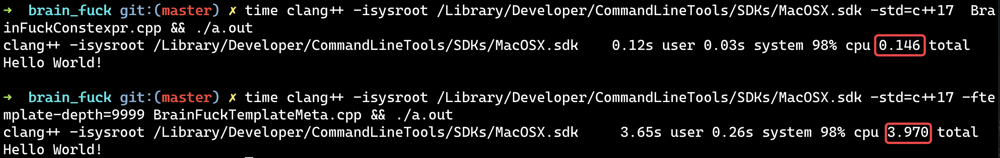

= CONSTEXPR 从 11 到 20
:customcss: ../presentation.css
:revealjsdir: ../node_modules/reveal.js
:revealjs_plugins: ../presentation_plugins.js
:revealjs_plugins_configuration: ../presentation_plugins_conf.js
:revealjs_theme: serif
:highlightjs-theme: https://cdn.jsdelivr.net/npm/highlight.js@10.2.1/styles/github-gist.css
:source-highlighter: highlightjs
:highlightjs-languages: cpp,x86asm,haskell
:revealjs_history: true
:revealjs_pdfseparatefragments: false
:revealjs_transition: slide
:revealjs_slideNumber: c/t
:revealjs_fragmentInURL: true
:icons: font
:stem:
Netcan {docdate} @Shanghai

[subtitle]#constexpr auto 😀#

template metaprogramming is dead +
long live constexpr

include::../common/self_introduction.adoc[]

== 议程
* 编译时计算（元编程）
* 演进历史
* constexpr vs 模板元
* 深入constexpr
* 应用
* 展望未来
* 结论

== 编译时计算（元编程）
* 零成本抽象
* 编译时多态 (eg. Policy class, Tag Dispatcher, CRTP)
* 值计算
* 类型安全 (eg. 单位运算, Phantom Types)
* Embedded Domain specific languages

=== 编译时计算（元编程）& 流派
* 模板元编程
* Constexpr all the things!
* 两者结合

[.columns]
== 演进历史
[.column]
--
模板元编程

* 1986 C++引入模板
* C++98 模板实例化
* C++11 模板类别名、可变模板参数、static_assert、decltype、type_traits
* C++14 decltype(auto)、integer_sequence
* C++17 CTAD、auto非类型参数、void_t
* C++20 Concept、放宽非类型参数
--

[.column]
--
constexpr

* C++11 引入constexpr简单函数
* C++14 放开constexpr约束, 模板变量
* C++17 if constexpr、constexpr lambda、fold expression
* C++20 constexpr容器、constexpr new、constexpr destructor、constexpr virtual、consteval/constinit、lambda模板参数
* constexpr STL algorithms
--

[.columns]
== constexpr vs 模板元编程
[.column]
--
BrainFuck语言

* 图灵完备
* 8种操作符
* DSL

https://fatiherikli.github.io/brainfuck-visualizer/#PisrKysrKysrWzwrKysrKysrKys+LV08LiAgICAgICAgICAgICAgICAgOyBICj4+KysrKysrKysrK1s8KysrKysrKysrKz4tXTwrLiAgICAgICAgICAgIDsgZQo+PisrKysrKysrK1s8KysrKysrKysrKysrPi1dPC4gICAgICAgICAgICA7IGwKPj4rKysrKysrKytbPCsrKysrKysrKysrKz4tXTwuICAgICAgICAgICAgOyBsCj4+KysrKysrKysrK1s8KysrKysrKysrKys+LV08Ky4gICAgICAgICAgIDsgbwo+PisrKytbPCsrKysrKysrPi1dPC4gICAgICAgICAgICAgICAgICAgICA7Cj4+KysrKysrKysrKytbPCsrKysrKysrPi1dPC0uICAgICAgICAgICAgIDsgVwo+PisrKysrKysrKytbPCsrKysrKysrKysrPi1dPCsuICAgICAgICAgICA7IG8KPj4rKysrKysrKysrWzwrKysrKysrKysrKys+LV08LS0tLS0tLiAgICAgOyByCj4+KysrKysrKysrWzwrKysrKysrKysrKys+LV08LiAgICAgICAgICAgIDsgbAo+PisrKysrKysrKytbPCsrKysrKysrKys+LV08LiAgICAgICAgICAgICA7IGQKPj4rKysrKytbPCsrKysrKz4tXTwtLS0uICAgIC[brainfuck-visualizer]
--

[.column]
--
[cols="2"]
|===
| > |	++ptr;
| < |	--ptr;
| + |	++*ptr;
| - |	--*ptr;
| . |	putchar(*ptr);
| , |	*ptr = getchar();
| [ |	while (*ptr) {
| ] |	}

|===
--

=== BrainFuck: Hello world
[source,cpp]
----
puts( R"(
    >++++++++[<+++++++++>-]<.             ; H   (8*9     = 72)
    >>++++++++++[<++++++++++>-]<+.        ; e   (10*10+1 = 101)
    >>+++++++++[<++++++++++++>-]<.        ; l   (9*12    = 108)
    >>+++++++++[<++++++++++++>-]<.        ; l   (9*12    = 108)
    >>++++++++++[<+++++++++++>-]<+.       ; o   (10*11+1 = 111)
    >>++++[<++++++++>-]<.                 ; ' ' (4*8     = 32)
    >>+++++++++++[<++++++++>-]<-.         ; W   (11*8-1  = 87)
    >>++++++++++[<+++++++++++>-]<+.       ; o   (10*11+1 = 111)
    >>++++++++++[<++++++++++++>-]<------. ; r   (10*12-6 = 114)
    >>+++++++++[<++++++++++++>-]<.        ; l   (9*12    = 108)
    >>++++++++++[<++++++++++>-]<.         ; d   (10*10   = 100)
    >>++++++[<++++++>-]<---.              ; !   (6*6-3   = 33)
)"_brain_fuck );
----

== BrainFuck编译器：模板元解法
Full code: https://godbolt.org/z/GTKxhc[https://godbolt.org/z/GTKxhc]

基础元数据结构
[source,cpp]
----
template<char c>
using Cell = std::integral_constant<char, c>;

template<size_t P = 0, bool INLOOP = false, typename ...Cells>
struct Machine {
    using type = Machine<P, INLOOP, Cells...>;
    constexpr static bool InLoop = INLOOP;
};
----

=== BrainFuck编译器：模板元解法
Full code: https://godbolt.org/z/GTKxhc[https://godbolt.org/z/GTKxhc]

相关操作
[source,cpp,subs="verbatim,quotes"]
----
namespace MachineTrait {
    template<size_t N>
    struct *InitMachine*: Concat_t<Machine<0, 0, Cell<0>>, typename *InitMachine<N-1>*::type> {};
    template<> struct *InitMachine<0>: Machine<0, 0, Cell<0>>* {};

    template<typename MACHINE> struct Inc;
    template<typename MACHINE> using Inc_t = typename Inc<MACHINE>::type;
    template<size_t PC, bool INLOOP, typename C, typename... Cells>
    struct Inc<Machine<PC, INLOOP, C, Cells...>>:
        Concat_t<Machine<PC, INLOOP, C>, Inc_t<Machine<PC - 1, INLOOP, Cells...>>> {};
    template<bool INLOOP, typename C, typename... Cells>
    struct Inc<Machine<0, INLOOP, C, Cells...>>:
        Machine<0, INLOOP, Cell< *C::value + 1* >, Cells...> {};

    template<typename MACHINE>
    struct Left;
    template<typename MACHINE>
    using Left_t = typename Left<MACHINE>::type;
    template<size_t PC, bool INLOOP, typename... Cells>
    struct Left<Machine<PC, INLOOP, Cells...>>:
        Machine< *PC-1*, INLOOP, Cells...> {};
};
----

=== BrainFuck编译器：模板元解法
Full code: https://godbolt.org/z/GTKxhc[https://godbolt.org/z/GTKxhc]

解析BrainFuck代码：基本操作
[source,cpp,subs="verbatim,quotes"]
----
template<typename MACHINE, bool skip, char ...cs>
struct BrainFuck: MACHINE {};
template<typename MACHINE, bool skip, char ...cs>
using BrainFuck_t = typename BrainFuck<MACHINE, skip, cs...>::type;

template<typename MACHINE, char ...cs>
struct BrainFuck<MACHINE, false, *'+'*, cs...>:
    BrainFuck_t<MachineTrait::Inc_t<MACHINE>, false, cs...> {};

template<typename MACHINE, char ...cs>
struct BrainFuck<MACHINE, false, *'-'*, cs...>:
    BrainFuck_t<MachineTrait::Dec_t<MACHINE>, false, cs...> {};

template<typename MACHINE, char ...cs>
struct BrainFuck<MACHINE, false, *'<'*, cs...>:
    BrainFuck_t<MachineTrait::Left_t<MACHINE>, false, cs...> {};

template<typename MACHINE, char ...cs>
struct BrainFuck<MACHINE, false, *'>'*, cs...>:
    BrainFuck_t<MachineTrait::Right_t<MACHINE>, false, cs...> {};
----

=== BrainFuck编译器：模板元解法
Full code: https://godbolt.org/z/GTKxhc[https://godbolt.org/z/GTKxhc]

解析BrainFuck代码：循环 & 分支
[source,cpp,subs="verbatim,quotes"]
----
template<typename MACHINE, char ...cs>
struct BrainFuck<MACHINE, false, *'['*, cs...> {
    using EnableLoopedMachine = MachineTrait::EnableLoop_t<MACHINE>;

    template<typename IN, bool = MachineTrait::IsZero_t<IN>::value>
    struct Select: BrainFuck_t<IN, true, cs...> {}; // skip
    template<typename IN> // loop
    struct Select<IN, false>: BrainFuck_t<IN, false, cs...> {};

    using Result = typename Select<EnableLoopedMachine>::type;

    template<typename IN, bool = (! MachineTrait::IsZero_t<IN>::value && IN::InLoop)>
    struct Loop: IN {};   // skip
    template<typename IN> // continue
    struct Loop<IN, true>: BrainFuck_t<IN, false, '[', cs...> {};

    using type = typename Loop<Result>::type;
};
----

=== BrainFuck编译器：模板元解法
Full code: https://godbolt.org/z/GTKxhc[https://godbolt.org/z/GTKxhc]

保存结果
[source,cpp]
----
template<size_t PC, bool INLOOP, typename ...Cells>
inline const auto ToStr(Machine<PC, INLOOP, Cells...>) {
    constexpr const static char str[] = { Cells::value ...  };
    return str;
}

template<typename T, T... cs>
constexpr auto operator ""_brain_fuck() {
    using Machine = MachineTrait::InitMachine_t<15>;
    using Result = BrainFuck_t<Machine, false, cs...>;

    return ToStr(Result{});
};
----

=== BrainFuck编译器：模板元解法
Full code: https://godbolt.org/z/GTKxhc[https://godbolt.org/z/GTKxhc]

生成代码
[source,x86asm,subs="verbatim,quotes"]
----
main:
    subq    $8, %rsp
    movl    $MachineTrait::ToStr<...>(Machine<...>)::str, %edi
    call    puts
    xorl    %eax, %eax
    addq    $8, %rsp
    ret
MachineTrait::ToStr<...>(Machine<...>)::str:
    .string *"Hello World!"*
    .string ""
    .string ""
    .string ""
----

== BrainFuck编译器：constexpr解法
Full code: https://godbolt.org/z/EYn7PG[https://godbolt.org/z/EYn7PG]

基础数据结构
[source,cpp]
----
template<size_t N>
class Stream {
public:
    constexpr void push(char c) { data_[idx_++] = c; }
    constexpr operator const char*() const { return data_; }
    constexpr size_t size() { return idx_; }
private:
    size_t idx_{};
    char data_[N]{};
};
----

=== BrainFuck编译器：constexpr解法
Full code: https://godbolt.org/z/EYn7PG[https://godbolt.org/z/EYn7PG]

解析器
[source,cpp]
----
template<typename STREAM>
constexpr auto parse(const char* input, bool skip, char* cells,
        size_t& pc, STREAM&& output) -> size_t {
    const char* c = input;
    while(*c) {
        switch(*c) {
            case '+': if (!skip) ++cells[pc];            break;
            case '-': if (!skip) --cells[pc];            break;
            case '.': if (!skip) output.push(cells[pc]); break;
            case '>': if (!skip) ++pc;                   break;
            case '<': if (!skip) --pc;                   break;
            case '[': {
                while (!skip && cells[pc] != 0)
                    parse(c + 1, false, cells, pc, std::forward<STREAM>(output));
                c += parse(c + 1, true, cells, pc, std::forward<STREAM>(output)) + 1;
            } break;
            case ']': return c - input;
            default: break;
        }
        ++c;
    }
    return c - input;
}
----

=== BrainFuck编译器：constexpr解法
Full code: https://godbolt.org/z/EYn7PG[https://godbolt.org/z/EYn7PG]

整合一起：
[source,cpp]
----
constexpr size_t CELL_SIZE = 16;
template<typename STREAM>
constexpr auto parse(const char* input, STREAM&& output) -> STREAM&& {
    char cells[CELL_SIZE]{};
    size_t pc{};
    parse(input, false, cells, pc, output);
    return std::forward<STREAM>(output);
}

template<size_t OUTPUT_SIZE = 15>
constexpr auto brain_fuck(const char* input) {
    return parse(input, Stream<OUTPUT_SIZE>{});
}
----

=== BrainFuck编译器：constexpr解法
Full code: https://godbolt.org/z/EYn7PG[https://godbolt.org/z/EYn7PG]

编译、运行时使用：
[source,cpp]
----
// compile time
constexpr auto res = brain_fuck(R"(
    ++++++++[>++++[>++>+++>+++>+<<<<-]>+>+>->>+[<]<-]>>.
    >---.+++++++..+++.>>.<-.<.+++.------.--------.>>+.>++.
)");
puts(res);

// runtime
if (argc > 1) puts(brain_fuck(argv[1]));
----

=== BrainFuck编译器：constexpr解法
[source,cpp,subs="verbatim,quotes"]
----
template<size_t *OUTPUT_SIZE* = 15>
constexpr auto brain_fuck(const char* input);
----

icon:question[role="orange"]
若OUTPUT_SIZE过小，会怎么样

image::brain_fuck_buffer_overflow.png[]

icon:lightbulb-o[]
编译报错，*不允许内存越界ub*

=== BrainFuck编译器：constexpr解法
[source,cpp,subs="verbatim,quotes"]
----
template<size_t *OUTPUT_SIZE* = 15>
constexpr auto brain_fuck(const char* input);
----

icon:question[role="orange"]
如何提前知道OUTPUT_SIZE所需要大小

[source,cpp,subs="verbatim,quotes"]
----
// calculate output size
constexpr auto *brain_fuck_output_size*(const char* input) -> size_t {
    struct {
        size_t sz{};
        constexpr void push(...) { ++sz; }
    } dummy;
    return parse(input, dummy).sz + 1; // include '\0'
}

#define BRAIN_FUCK(in) brain_fuck< *brain_fuck_output_size(in)* >(in)
constexpr auto res = BRAIN_FUCK(R"(
    ++++++++[>++++[>++>+++>+++>+<<<<-]>+>+>->>+[<]<-]>>.
    >---.+++++++..+++.>>.<-.<.+++.------.--------.>>+.>++.
)");
----

== constexpr vs 模板元编程
icon:question[role="orange"]
编译时间

0.13s vs 4.088s ! 30x speed up icon:angle-double-up[role="red"]

=== constexpr vs 模板元编程
模板元 http://redd.it/jnz5p1[http://redd.it/jnz5p1]

* Looks both *scary* and *exciting* at the same time. :P
* After reading this code I gotta *remove C++* from the programming languages I know list.  Sweet mother of god this is *incredible*! :,)
* C++ templates is a language within a language, now you have brainf*ck in templates, so it's a language withing a language within a language. It's languageception.
* Nice, definitely *scary* stuff though.
* Where does one learn to use templates like that? I have no idea what I'm looking at
* Lots of mind altering drugs
* From my experience, templates like this are *hard to casually read* even if you are the one who wrote them. It makes perfect sense when you are *creating the monstrosity* though.
* Actually, for what it is, it's incredibly *readable*.
* Awesome, Now make a c++ compiler with brainfuck :p
* I've been planning on trying something similar with Ruby, to see if the C++ compiler can generate a minimal program.

=== constexpr vs 模板元编程
模板元 https://zhuanlan.zhihu.com/p/273805962[https://zhuanlan.zhihu.com/p/273805962], https://www.zhihu.com/question/334884938/answer/1557544809[https://www.zhihu.com/question/334884938]

* 年轻人，没见识过面向脑容量编程吧
* 高级语言比汇编还难读
* 你是魔鬼吗
* 好聪明的编译器
* 机器进化成人了，简称人肉编译器...
* 不至于不至于
* 据说写BrainFuck会感觉brain被fuck了…

=== constexpr vs 模板元编程
constexpr http://redd.it/jp7k0u[http://redd.it/jp7k0u]

* Amazing, very neat, show the *power* of constexpr functions, way more *readable* than template.
* Wow. Your constexpr code is vastly more *readable* than the template metaprogramming one.

[.columns]
=== constexpr vs 模板元编程
[.column]
--
简单设计：模板元

* 通过所有测试(static_assert) icon:check-circle[role="green"]
* 没有重复，易于重用 icon:check-circle[role="green"]
* 表达意图，易于理解（~200 lines） icon:times[role="red"]
* 没有冗余，避免过度设计 icon:ellipsis-h[role="orange"]
--

[.column]
--
简单设计：constexpr

* 通过所有测试(static_assert) icon:check-circle[role="green"]
* 没有重复，易于重用 icon:check-circle[role="green"]
* 表达意图，易于理解（~80 lines） icon:check-circle[role="green"]
* 没有冗余，避免过度设计 icon:check-circle[role="green"]
--

[.columns]
=== constexpr vs 模板元编程
[.column]
--
模板元优缺点

* 运行时效率
* 体系成熟，拥有大量的库 +
参考资料多
* TypeList可以任意扩容（可变模板参数）
* 可读性差，维护性差
* 编译错误信息难懂；编译速度慢；跨平台（编译器）弱
--

[.column]
--
constexpr优缺点

* 运行时效率
* 新兴势力，生态待完善 +
参考资料少，挖掘空间大
* C++20之前需要提前计算容器大小
* 可读性强，维护性强，更少的魔法
* 编译错误信息易懂；编译速度快；跨平台（编译器）强
--

== Constexpr all the things!
image::constexpr-all-the-things.png[80%,80%]

== 深入constexpr
* constexpr常量
* 折叠表达式：fold expression
* constexpr函数、lambda
* consteval/constinit
* if constexpr
* constexpr容器、算法
* constexpr destructor
* 检测Undefined Behaviour

=== constexpr常量
[source,cpp]
----
#define CODE R"(                                               \
        ++++++++[>++++[>++>+++>+++>+<<<<-]>+>+>->>+[<]<-]>>.   \
        >---.+++++++..+++.>>.<-.<.+++.------.--------.>>+.>++. \
    )"
constexpr auto res = brain_fuck(CODE);
----
icon:angle-double-down[role="icon-center"]
[source,cpp,subs="verbatim,quotes"]
----
const char* CODE = R"(
        ++++++++[>++++[>++>+++>+++>+<<<<-]>+>+>->>+[<]<-]>>.
        >---.+++++++..+++.>>.<-.<.+++.------.--------.>>+.>++.
    )";
// error: constexpr variable 'res' must be initialized by a *constant expression*
constexpr auto res = brain_fuck(CODE);
----
icon:angle-double-down[role="icon-center"]
[source,cpp,subs="verbatim,quotes"]
----
constexpr const char* CODE = R"(
        ++++++++[>++++[>++>+++>+++>+<<<<-]>+>+>->>+[<]<-]>>.
        >---.+++++++..+++.>>.<-.<.+++.------.--------.>>+.>++.
    )";
constexpr auto res = brain_fuck(CODE);
----

=== constexpr模板常量
做常量别名
[source,cpp]
----
template<class T>
constexpr bool is_class_v = is_class<T>::value;
----

类Haskell风格：
[source,cpp]
----
template<char c>
constexpr bool is_digit = (c >= '0' && c <= '9');

template<char c>
constexpr bool is_digit_or_dot = (is_digit<c> || c == '.');

static_assert(! is_digit<'x'>);
static_assert(is_digit<'0'>);
----

[source,haskell]
----
isDight :: Char -> Bool
isDight c = (c >= '0' && c <= '9')

isDightOrDot :: Char -> Bool
isDightOrDot c = (c >= '0' && c <= '9' || c == '.')

*Main> isDight 'x'
False
*Main> isDight '0'
True
----

=== 折叠表达式 fold expression
[source,cpp,subs="verbatim,quotes"]
----
template<char c, char... cs>
constexpr bool is_sign_valid = ((c == '+' || c == '-') && sizeof...(cs) > 0)
                                || is_digit_or_dot<c>;

template<char... cs>
constexpr size_t number_of_dots = ((cs == '.' ? 1 : 0) + *...* + 0);

template<char c, char... cs>
constexpr bool is_integer = is_sign_valid<c, cs...> &&
                            (is_digit<cs> && *...*);

template<char... cs>
constexpr bool is_double = is_sign_valid<cs...> &&
                           ( (is_digit_or_dot<cs>) && *...*) &&
                           number_of_dots<cs...> == 1;

template<char... cs>
constexpr bool is_number_valid = (is_integer<cs...> || is_double<cs...>);

static_assert(is_number_valid<'1', '2', '3', '.', '4'>);
static_assert(! is_number_valid<'a', 'b', 'c', 'd'>);
----

=== constexpr 函数 & lambda
C++17起，lambda默认为constexpr
[source,cpp]
----
// constexpr int fibonacci(int n);
auto fibonacci =  {
    int a = 0, b = 1;
    for (int c = 0; c < n; ++ c) {
        int t = a + b;
        a = b;
        b = t;
    }
    return a;
};

constexpr auto v = fibonacci(10);
static_assert(v == 55);
----

=== consteval/constinit
consteval::
specifies that a function is an immediate function, that is, every call to the function must produce a *compile-time* constant.
constinit::
asserts that a variable has *static initialization*, i.e. zero initialization and constant initialization, otherwise the program is ill-formed.

=== if constexpr
icon:question[role="orange"]
如何求结构体字段个数

[source,cpp]
----
struct AnyType {
    template <typename T>
    operator T();
};

template <typename T>
consteval size_t CountMember(auto&&... Args) {
    if constexpr (requires { T{ Args... }; }) {    // <1>
        return CountMember<T>(Args..., AnyType{}); // <2>
    } else {
        return sizeof...(Args) - 1;                // <3>
    }
}

struct Test { int a; int b; int c; int d; };
static_assert(CountMember<Test>() == 4);
----

<1> 判断当前参数包是否能够成功 *聚合初始化* 对象T，C++20 concept特性
<2> 若 *聚合初始化* 成功，不断添加参数对T进行进一步 *聚合初始化*
<3> 若 *聚合初始化* 失败，字段个数为参数个数-1

=== constexpr容器、算法

=== constexpr destructor
icon:question[role="orange"]
如何优化 SFINAE解法
[source,cpp]
----
struct OptionalTrivially {};

template <typename T, typename Contained>
struct OptionalNonTrivially {
    ~OptionalNonTrivially() {
        if (static_cast<T*>(this)->initilzed_) {
            static_cast<T*>(this)->storage_.data.~Contained();
        }
    }
};

template <typename Contained>
struct Optional: std::conditional_t<std::is_trivially_destructible_v<Contained>,
                                    OptionalTrivially,
                                    OptionalNonTrivially<Optional<Contained>, Contained>> {
    constexpr Optional& operator=(Contained&& data) {
        storage_.data = std::move(data);
        initilzed_ = true;
        return *this;
    }

    Storage<Contained> storage_;
    bool initilzed_{};
};
----

=== constexpr destructor
icon:lightbulb-o[] if constexpr
[source,cpp]
----
template <typename Contained>
struct Optional {
    constexpr Optional& operator=(Contained&& data) {
        storage_.data = std::move(data);
        initilzed_ = true;
        return *this;
    }

    constexpr ~Optional() {
        if constexpr(! std::is_trivially_destructible_v<Contained>) {
            if (initilzed_) {
                this->storage_.data.~Contained();
                initilzed_ = false;
            }
        }
    }

    Storage<Contained> storage_;
    bool initilzed_{};
};
----

=== constexpr destructor
icon:lightbulb-o[] constexpr destructor
[source,cpp]
----
template <typename Contained>
struct Optional {
    constexpr Optional& operator=(Contained&& data) {
        storage_.data = std::move(data);
        initilzed_ = true;
        return *this;
    }

    constexpr ~Optional() requires (! std::is_trivially_destructible_v<Contained>) {
        if (initilzed_) {
            this->storage_.data.~Contained();
        }
    }
    constexpr ~Optional() = default;

    Storage<Contained> storage_;
    bool initilzed_{};
};
----

=== 检测Undefined Behaviour
[source,cpp]
----
const double x1=100/0;                               // <1>
const int x2 = std::numeric_limits<int>::min() / -1; // <2>

constexpr double y1=100/0;                               // <3>
constexpr int y2 = std::numeric_limits<int>::min() / -1; // <4>
----

<1> warning: division by zero
<2> no warning in clang
<3> error: division by zero is not a constant expression
<4> error: overflow in constant expression

[source,cpp]
----
constexpr int bar() {
    int* p = nullptr;
    return *p;
}

constexpr auto foo = bar(); // <1>
----
<1> error: dereferencing a null pointer

=== 检测Undefined Behaviour
[source,cpp]
----
constexpr int foo(const int *p) {
    return *(p + 12); <1>
}

constexpr void bar() {
    constexpr int arr[10]{};
    constexpr int x = foo(arr);
}
----
<1> error: array subscript value '12' is outside the bounds of array 'arr' of type 'const int [10]'

[source,cpp]
----
constexpr int& foo(){
    int x=23;
    return x;
}

constexpr int bar() {
    constexpr int x = foo(); <1>
    return x;
}
----
<1> error: constexpr variable 'x' must be initialized by a constant expression. note: read of variable whose lifetime has ended

=== 检测Undefined Behaviour
[source,cpp]
----
constexpr int foo(int x) {
   if(x) return 1;
}

void bar(){
    constexpr int x = foo(0); <1>
}
----
<1> error: 'constexpr' call flows off the end of the function

== Reference
* http://odinthenerd.blogspot.com/2014/07/introduction-to-c-metaprogramming-part-1.html[Introduction to C++ Metaprogramming]
* https://www.youtube.com/watch?v=A3_xrqr5Kdw[C++ Weekly - Ep 231 - Multiple Destructors in C++20?! How and Why]
* https://github.com/trailofbits/constexpr-everything[https://github.com/trailofbits/constexpr-everything]
* https://shafik.github.io/c++/undefined%20behavior/2019/05/11/explporing_undefined_behavior_using_constexpr.html[Exploring Undefined Behavior Using Constexpr]

