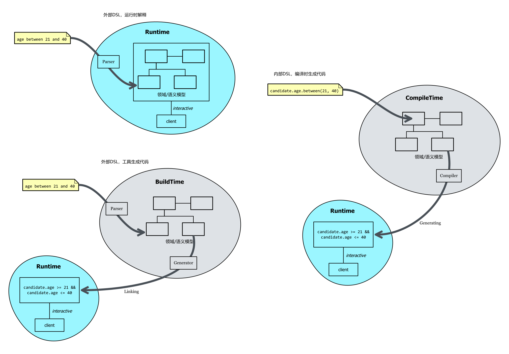

= Embedded Domain-Specific Languages in Industry
:customcss: ./custom.css
:revealjsdir: https://cdn.jsdelivr.net/npm/reveal.js@3.9.2
:revealjs_plugins: ../presentation_plugins.js
:revealjs_plugins_configuration: ../presentation_plugins_conf.js
:revealjs_theme: serif
:highlightjs-theme: https://cdn.jsdelivr.net/npm/highlight.js@10.2.1/styles/github-gist.css
:highlightjs-languages: cpp,haskell
:source-highlighter: highlightjs
:revealjs_history: true
:revealjs_pdfseparatefragments: false
:revealjs_transition: slide
:revealjs_slideNumber: c/t
:revealjs_fragmentInURL: true
:icons: font
:stem:
Netcan {docdate} @Beijing

[subtitle]#using C++ metaprogramming☯#

include::../common/self_introduction.adoc[]

== 议程
* C++元编程技术
** Why C++
** 什么是元编程
** 元编程与函数式编程范式
* 内部领域特定语言
** What
** Why
** Examples
** How

== DSL种类
外部DSL::
独立于宿主语言，需要构建单独的开发环境

* HTML/CSS
* XML
* GL Shader
* Makefile
* Latex/AsciiDoctor/Markdown
* SQL
* Regex

内部DSL::
融入于宿主语言，能够直接与宿主语言交互，复用开发环境

=== eDSL实现手段
* 操作宿主语言语法树：Rust宏
* Fluent Interface：OOP like语言
* Monad：FP like语言
* 反射式元编程：动态语言、编译器注解
* 运行时元编程：动态语言
* icon:smile[role="blue"] 编译时元编程：C++

=== Why C++
* 能够与硬件直接映射，性能高
* 通用多范式语言，拥有足够丰富的手段应对各种场景
* 解决方案成熟，资源多，专家多

=== 何为元编程
* 编译器解析执行代码，并 [.blue]*生成* 代码、数据
* 将运行时逻辑挪到编译时计算，实现零成本抽象
* 运行时拥有改变结构的能力，动静结合

C++使用模板与constexpr特性进行 [.blue]#编译时# 元编程，纯函数式编程范式，图灵完备

=== 何为元编程
image::metaprogramming_fun.jpg[]

[.columns]
=== 编译时元编程
[.column]
--
运行时计算（允许副作用）

* 数值（IO输入）
* 对象（动态创建）
* 过程（普通函数、lambda）
--

[.column]
--
编译时计算（禁止副作用）

* 数值（字面常量）
* 类型
* 对象 (C++20)
* 元函数（constexpr/template）
--

[.columns]
=== 元编程与函数式编程：值计算（模板）
[.column]
--
计算Fibonacci数列: stem:[f(n) = f(n-1) + f(n-2)]
[source,cpp]
----
template <size_t N> // <1>
struct Fibonacci {  // <2>
    constexpr static size_t value = // <3>
        Fibonacci<N - 1>::value +
        Fibonacci<N - 2>::value;
};

template <> struct Fibonacci<0> {   // <4>
    constexpr static size_t value = 0;
};

template <> struct Fibonacci<1> {   // <4>
    constexpr static size_t value = 1;
}

static_assert(Fibonacci<10>::value==55);
----

--
[.column]
--
[source,haskell]
----
fibonacci :: Int -> Int
fibonacci 0 = 0 // <4>
fibonacci 1 = 1 // <4>
fibonacci n = fibonacci (n - 1) +
              fibonacci (n - 2)
assert (fibonacci 10 == 55) ""
----

<1> 模板元函数 [.blue]#输入# 参数N，`size_t` 表明输入参数为 [.blue]#值#
<2> 模板元函数名 `Fibonacci`
<3> 模板元函数 [.blue]#输出# 返回 [.blue]#值# `value`
<4> 模式匹配，函数递归的边界条件
--

=== 元编程与函数式编程：值计算（constexpr）
icon:cog[] 通过函数
[source,cpp]
----
template<int N>
constexpr int fibonacci() {
  if constexpr (N == 0 || N == 1) {
    return N;
  } else {
    return fibonacci<N-1>() + fibonacci<N-2>();
  }
}
static_assert(fibonacci<10>() == 55);
----

icon:cog[] 通过值
[source,cpp]
----
template<size_t N>
constexpr size_t fibonacci = fibonacci<N-1> + fibonacci<N-2>;

template<>
constexpr size_t fibonacci<0> = 0;
template<>
constexpr size_t fibonacci<1> = 1;

static_assert(fibonacci<10> == 55);
----

=== 元编程与函数式编程：类型计算（模板）
计算类型 `T` 的N级指针类型

[source,cpp]
----
template<typename T, size_t N> // <1>
struct AddPointer // <2>
{ using type = typename AddPointer<T, N-1>::type *; }; // <3>

template<typename T> // <4>
struct AddPointer<T, 0>
{ using type = T; };

template<typename T, size_t N> // <5>
using AddPointer_t = typename AddPointer<T, N>::type;

AddPointer_t<int, 50> p; // int************************************************** p
----

<1> 模板元函数 [.blue]#输入# 类型T与值N，`typename` 表明输入参数是 [.blue]#类型#， `size_t` 表明输入参数为 [.blue]#值#
<2> 模板元函数名
<3> 模板元函数 [.blue]#输出# 返回 [.blue]#类型# `type`
<4> 模式匹配 `N == 0`
<5> 别名，方便调用

=== 元编程与函数式编程：类型计算（constexpr）
计算类型 `T` 的N级指针类型

icon:cog[] 通过函数
[source,cpp]
----
template<typename T, size_t N>
constexpr auto AddPointer() {
  if constexpr (N == 0) {
    return T{};
  } else {
    return (decltype(AddPointer<T, N-1>())*){};
  }
}

template<typename T, size_t N>
using AddPointer_t = decltype(AddPointer<T, N>());
----

icon:cog[] 通过值
[source,cpp]
----
template<typename T, size_t N>
constexpr auto AddPointer = (decltype(AddPointer<T, N-1>)*){};

template<typename T>
constexpr auto AddPointer<T, 0> = T{};

template<typename T, size_t N>
using AddPointer_t = decltype(AddPointer<T, N>);
----

=== 元编程与函数式编程：类型计算
C++如何实现一个给定维度的多维变长数组类型?
https://www.zhihu.com/question/468039165

[source,cpp]
----
template <typename T, std::size_t N> struct vector_n {
    using type = std::vector<typename vector_n<T, N - 1>::type>;
};

template <typename T> struct vector_n<T, 1> {
    using type = std::vector<T>;
};

auto vec = vector_n<int, 3>::type{} // std::vector<std::vector<std::vector<int>>>
----

[source,cpp]
----
template<typename T, size_t... Ns>
auto vector_n = vector<T>{};

template<typename T, size_t N>
auto vector_n<T, N> = vector<T>(N);

template<typename T, size_t N, size_t ...Ns>
auto vector_n<T, N, Ns...>
    = vector<decltype(vector_n<T, Ns...>)>
    ( N, vector_n<T, Ns...>);

auto vec = vector_n<int, 3, 4, 5>; // std::vector<std::vector<std::vector<int>>>
----

=== 元编程与函数式编程：列表数据结构
使用 `typelist` 做元编程的数据结构。
[source,cpp]
----
template <typename ...Ts> struct typelist {};

template <typename ...Ts>
constexpr auto typelist_v = typelist<Ts...> {};
----

=== 元编程与函数式编程：高阶函数（模板）
实现高阶函数 `fold`
[source,cpp]
----
// fold :: [a] -> b -> (b -> a -> b) -> b
// fold [] init _ = init
template<typename IN, typename INIT, template<typename, typename> class> // <1>
struct Fold { using type = INIT; }; // <2>

// fold (x:xs) acc op = fold xs (op acc x) op
template<typename ACC, template<typename, typename> class OP,
typename X, typename ...Xs>
struct Fold<typelist<X, Xs...>, ACC, OP>:
       Fold<typelist<Xs...>, typename OP<ACC, X>::type, OP> {}; // <3>

template<typename IN, typename INIT, template<typename, typename> class OP>
using Fold_t = typename Fold<IN, INIT, OP>::type;
----
<1> 输入类型参数 IN，初始类型参数 INIT, 二元函数 OP
<2> 默认返回初值；列表为空时递归终止返回当前 INIT 参数
<3> 对当前参数 X 执行二元函数 OP, 其返回类型更新 ACC 参数

=== 元编程与函数式编程：高阶函数（constexpr）
实现高阶函数 `fold`
[source,cpp]
----
// fold [] init _ = init
constexpr auto fold(typelist<>, auto init, auto) { return init; }

// fold (x:xs) acc op = fold xs (op acc x) op
template<typename X, typename ...Xs>
constexpr auto fold(typelist<X, Xs...>, auto acc, auto op)
{       return fold(typelist_v<Xs...>, op(acc, X{}), op); }
----

[source,cpp]
----
template<int N> using Int = std::integral_constant<int, N>;
constexpr auto nums = typelist_v<Int<1>, Int<2>, Int<3>>;

constexpr auto sum = fold(nums, Int<0>{},  {
    return Int<acc.value + v.value>{};
});
static_assert(sum.value == 6);
----

=== 元编程与函数式编程：高阶函数（折叠表达式） icon:lightbulb[role="orange"]
实现高阶函数 `fold`

[source,cpp]
----
template<typename T, typename OP>
struct Foldable {
    using type = T;
    template<typename L, typename R>
    friend constexpr auto operator>>(Foldable<L, OP>, Foldable<R, OP>) ->
        Foldable<decltype(OP{}(L{}, R{})), OP>;
};

template<typename ...Xs, typename INIT, typename OP>
constexpr auto fold(typelist<Xs...>, INIT init, OP op) {
    return typename decltype((
        Foldable<INIT, OP>{} >> ... >> Foldable<Xs, OP>{}
    ))::type{};
}
----
编译时间快10 ~ 35% icon:angle-double-up[role="red"]

=== 元编程 & eDSL 鼻祖Lisp

[cols="1,1"]
|===
|Lisp |C++

|符号
|type

|表
|typelist
|===

=== 编程语言的本质

[.text-center]
image::eval_apply.svg[]

== 领域驱动设计
video::InformalConfusedAmericangoldfinch.mp4[opts="autoplay"]

=== 领域特定语言
DSL == 领域模型 + 语言

DSL == 语义模型 + 语法

DSL == 原语 + 组合 + 解释

将领域规则以 [.blue]#语法# 和 [.blue]#语义# 形式编码

=== 优势
[source,cpp]
----
constexpr bool isValidNumber(std::string_view num) {
    return ctre::match<"\\d{3}-\\d{3}-\\d{4}">(num);
}
----

[.icon-center]#VS#

[source,cpp]
----
constexpr bool isDigit(char c) {
    return c >= '0' && c <= '9';
}
constexpr bool isValidNumber(std::string_view num) {
    // \d{3}-\d{3}-\d{4}
    if (num.size() != 12) { return false; }
    size_t i = 0;
    while (i < 3 && isDigit(num[i])) ++i;
    if (i != 3 || num[i++] != '-') return false;
    while (i < 7 && isDigit(num[i])) ++i;
    if (i != 7 || num[i++] != '-') return false;
    while (i < 12 && isDigit(num[i])) ++i;
    if (i != 12) return false;
    return true;
}
----

[source,cpp]
----
static_assert(!isValidNumber("2333"));
static_assert(isValidNumber("123-456-7890"));
----

=== 内部 vs 外部

=== 全局最短路径

- 存在环：A->B->A
- A->D最短路径其实是A->C->D
- D->E不可达

=== 全局最短路eDSL
[source,cpp]
----
template<char ID>
struct Node { constexpr static char id = ID; };
using A = Node<'A'>;
using B = Node<'B'>;
using C = Node<'C'>;
using D = Node<'D'>;
using E = Node<'E'>;

using g = Graph< // <1>
    link(node(A) -> node(B) -> node(C) -> node(D)),
    link(node(A) -> node(C)),  // test shortest path: A -> C -> D
    link(node(B) -> node(A)),  // test cycle
    link(node(A) -> node(E))>; // test D -> E unreachable

static_assert(g::getPath('A', 'D').sz == 3);    // compile-time test <2>
auto path = g::getPath(argv[1][0], argv[2][0]); // runtime test      <2>
std::cout << " path size: " << path.sz << std::endl;
----
<1> 用户构造边集，返回Graph对象
<2> Graph对象生成的getPath接口既能用于编译时，也能运行时

https://github.com/netcan/recipes/blob/master/cpp/metaproggramming/FindShortestPath.cpp[FindShortestPath.cpp]

=== Graph DSL
https://github.com/godsme/graph-dsl

image::https://raw.githubusercontent.com/godsme/graph-dsl/master/doc/graph.png[]

=== Graph DSL
[source,cpp]
----
using sub_graph_1 = __g_SUB_GRAPH(
    (root_0, (port_1) -> node_8
           , (port_2) -> __g_MAYBE(cond_2, node_3)
           , (port_3) -> __g_EITHER(cond_1, node_8, node_4)
           , (port_4) -> __g_FORK(node_5, node_4, __g_MAYBE(cond_2, node_8))),
    (root_1, (port_1) -> node_7),
    (node_5, (port_5) -> node_8
           , (port_6) -> __g_FORK(node_4, __g_MAYBE(cond_2, node_3))),
    (node_3, (port_7) -> node_4
           , (port_8) -> __g_FORK(node_8, node_6)
           , (port_9) -> node_7));

using sub_graph_2 = __g_SUB_GRAPH(
    (root_0  , (port_1) -> node_9),
    (root_1  , (port_1) -> node_10
             , (port_2) -> __g_MAYBE(cond_2, node_11)
             , (port_3) -> __g_EITHER(cond_1, node_12, node_13)),
    (node_11 , (port_10) -> node_12
             , (port_11) -> __g_FORK(node_13, node_14)
             , (port_12) -> node_15));

using graph = __g_GRAPH(
    (root_0, root_1),
    (cond_3) -> sub_graph_1,
    (cond_4) -> sub_graph_2);

graph g;
g.refresh(context);
----

=== Graph DSL in details（constexpr）
[source,cpp]
----
constexpr static auto sorted_non_leaf_nodes =
    all_decedents_map // typelist<pair<node, typelist<node>>>
    | holo::sort( {
        return holo::contains(holo::first(l), holo::second(r)); })
    | holo::transform( {
        return holo::first(elem); })
    | holo::reverse();

constexpr static auto root_nodes =
    typelist_v<NODES...>
    | holo::filter({
        return decltype(elem)::type::is_root == holo::true_c; })
    | holo::transform({
        return holo::type_c<typename decltype(elem)::type::node_type>;
    });
----

=== Graph DSL in details（constexpr）
[source,cpp]
----
constexpr static auto sorted_tagged_intermediate_nodes =
    sorted_non_leaf_nodes
    | holo::remove_if( {
        return holo::contains(elem, root_nodes); })
    | holo::transform( {
        return holo::type_c<node_trait<typename decltype(elem)::type,
                                       node_category::Intermediate>>;
    });

constexpr static auto leaf_tagged_nodes =
    all_decedents_map
    | holo::fold_left(typelist_v<>, {
        return holo::concat(acc, holo::second(elem)); })
    | holo::unique()
    | holo::remove_if( {
        return holo::contains(elem, sorted_non_leaf_nodes); })
    | holo::transform( {
        return holo::type_c<node_trait<typename decltype(elem)::type,
                            node_category::Leaf>>;
    });
----

=== Graph DSL in details（模板）
[source,cpp]
----
class SortedTaggedIntermediateNodes {
    template<typename DESC>
    struct GetDescNode: Return<typename DESC::NodeType> { };

    template<typename NODE>
    struct IsIntermediateNode: std::bool_constant<!NODE::IsSource> {};

    using IntermediateNodes = Map_t<Filter_t<AllNodesDesc,
                                    IsIntermediateNode>,
                                    GetDescNode>;

    template<typename NODE>
    struct IsInIntermediateNodes: Elem<IntermediateNodes, NODE> {};

    template<typename NODE>
    struct IntermediateTagged: Return<NodeTrait<NODE, NodeCategory::Intermediate>> {};

public:
    using type = Map_t<Filter_t<SortedNonSinkNodes_t, IsInIntermediateNodes>,
                       IntermediateTagged>;
};
----

=== TransDSL
[quote, 袁英杰, 'https://trans-dsl-2.readthedocs.io/zh_CN/latest/']
____
Transaction DSL 是一套使用C++编写的领域专用语言，通过它，可以简单直观的描述任意复杂的异步通信过程。
____

[%notitle]
=== TransDSL
image::recruting.png[]

=== TransDSL
[source,cpp]
----
__transaction
( __asyn(ApplicationAcceptance)
, __concurrent
    ( __asyn(BackgroundInvestigation)
    , __sequential
        ( __asyn(Exam)
        , __asyn(Interview)))
, __asyn(OfferNegotiation)
, __time_guard(TIMER_ONBOARD, __asyn(OnBoard))));
----

=== Task Builder DSL
PR链接： https://github.com/taskow/taskow/pull/222
[source,cpp]
----
tf::Executor executor;
tf::Taskflow taskflow("simple");
auto A = taskflow.emplace( { std::cout << "TaskA\n"; }); //         +---+
auto B = taskflow.emplace( { std::cout << "TaskB\n"; }); //   +---->| B |-----+
auto C = taskflow.emplace( { std::cout << "TaskC\n"; }); //   |     +---+     |
auto D = taskflow.emplace( { std::cout << "TaskD\n"; }); // +---+           +-v-+
                                                             // | A |           | D |
A.precede(B); // B runs after A                              // +---+           +-^-+
A.precede(C); // C runs after A                              //   |     +---+     |
B.precede(D); // D runs after B                              //   +---->| C |-----+
C.precede(D); // D runs after C                              //         +---+
executor.run(taskflow).wait();
----

[source,cpp]
----
tf::Executor executor;
tf::Taskflow taskflow("simple");
def_task((A), { std::cout << "TaskA\n"; }); //         +---+
def_task((B), { std::cout << "TaskB\n"; }); //   +---->| B |-----+
def_task((C), { std::cout << "TaskC\n"; }); //   |     +---+     |
def_task((D), { std::cout << "TaskD\n"; }); // +---+           +-v-+
                                            // | A |           | D |
taskbuild(                                  // +---+           +-^-+
  task(A)                                   //   |     +---+     |
    ->fork(B, C)                            //   +---->| C |-----+
    ->task(D)                               //         +---+
)(taskflow);
executor.run(taskflow).wait();
----

=== Task Builder DSL: Context
[source,cpp]
----
int counter;                                      // A
struct Context {                                  // |
    int &rcounter; // use counter(borrow)         // v
} context{counter};                               // B<---|
                                                  // |    |
def_task((A, Context), { rcounter=0; });          // v    |
def_task((B, Context), { rcounter++; });          // C----|
def_task((C, Context), {                          // |
    if (rcounter != 5) {                          // v
        std::cout << "loops again (goes to B)\n"; // D
        return 0;
    }
    std::cout << "breaks the loop (goes to D)\n";
    return 1;
});
def_task((D, Context), {
    std::cout << "done with counter equal to " << rcounter << '\n';
});

auto tasks = taskbuild(
    task(A) -> task(B) -> task(C),
    task(C) -> fork(B, D)
)(taskflow, context);
----

=== Fluent interface: Easy Graph
https://github.com/MagicBowen/easy-graph
[source,cpp]
----
GRAPH(cond, "condition") { // <1>
    CTRL_CHAIN(Node("a") -> Node("b")); // <2>
};

GRAPH(body) { // <1>
    CHAIN(Node("a") -> Node("b") -> Node("c")); // <2>
};

GRAPH(graph) {
    auto sg_cond = subgraph_of(cond, iw_of(0, ep_of("a", 1)));
    auto sg_body = subgraph_of(body, ow_of(ep_of("c", 1), 1));

    auto foreach = node_of("foreach", sg_cond, sg_body, attr_of("loop", true));
    auto loop    = node_of("loop", sg_cond, subgraph_of(body, "loop body", ow_of(ep_of("b", 1), 0)));

    DATA_CHAIN(Node("const_1") -> Node(loop) -> Node("unique") -> Node("softmax"));
    DATA_CHAIN(Node("const_2") -> Node("while", subgraph_of(cond, iw_of(1, ep_of("a", 1))), subgraph_of(body, "while body")));
    CTRL_CHAIN(Node("case") -> Node("unique"));
    CTRL_CHAIN(Node(loop) -> Node(foreach));
};
----
<1> lambda，使用操作符重载 operator| 去除对 lambda 的调用
<2> 连贯接口

=== 结论：良好的DSL
* 关注点分离：What vs How
* 代码复用
* 零成本抽象：与手写代码相比无额外开销
* 使用特定词汇来表达领域
* 提供简单的、可组合的词汇
* 基于特定词汇构造大型系统

=== Reference
* https://netcan.github.io/presentation/metaprogramming/[Modern C++模板元编程]
* https://netcan.github.io/presentation/constexpr_from_11_20/#/[CONSTEXPR 从 11 到 20]

[state=thank]
== Thank you!

[state=thank]
== Question?
