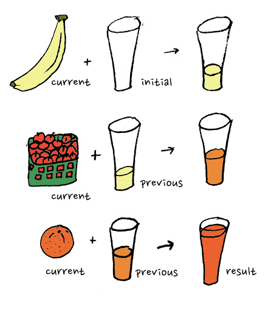

= C++模板元编程
:customcss: ../presentation.css
:revealjsdir: ../node_modules/reveal.js
:revealjs_plugins: ../presentation_plugins.js
:revealjs_plugins_configuration: ../presentation_plugins_conf.js
:revealjs_theme: serif
:highlightjs-theme: https://cdn.jsdelivr.net/npm/highlight.js@10.2.1/styles/atom-one-light.css
:highlightjs-languages: cpp
:source-highlighter: highlightjs
:revealjs_history: true
:revealjs_pdfseparatefragments: false
:revealjs_transition: zoom
:revealjs_slideNumber: c/t
:revealjs_fragmentInURL: true
:icons: font
:stem:
Netcan {docdate} @Shanghai

[subtitle]#template <typename 😀>#

== 模板介绍

[%step]
* 起初为了支持泛型替代宏而设计的语法
* 类型安全，编译期提前检查错误
* 人们无意中发现可以用于 [red]*编译期* 计算
* 语言标准发展不断完善元编程体验

== 泛型算法 & 宏

[.fragment]
[source,cpp]
----
#define MAX(X, Y) (((X) > (Y)) ? (X) : (Y))
MAX(a++, b++) // (((a++) > (b++)) ? (a++) : (b++))
MAX(0, "123") // runtime error
----

[.fragment]
[source,cpp,subs="none"]
----
void qsort( void *ptr, size_t count, size_t size,
    int (*comp)(const <mark>void *</mark>, const <mark>void *</mark>) );
----

[.fragment]
[source,cpp]
----
int values[] = { 88, 56, 100, 2, 25 };
int cmpfunc (const void* a, const void* b) {
   return ( *(int*)a - *(int*)b );
}
qsort(values, 5, sizeof(int), cmpfunc);
----

=== 泛型算法 & 模板函数
[.fragment]
[source,cpp]
----
template<typename T>
T max(T&& a, T&& b) {
    return a > b ? a : b;
}
----

[.fragment]
[source,cpp]
----
max(0, "123"); // error: no matching function for call to 'max(int, const char [4])'
----

[.fragment]
[source,cpp]
----
template<class RandomIt, class Compare>
void sort(RandomIt first, RandomIt last, Compare comp);
----

[.fragment]
[source,cpp]
----
int values[] = { 88, 56, 100, 2, 25 };
std::sort(values, values + 5,  {
    return a < b;
});
----

=== 泛型容器 & 宏
[source,cpp]
----
// collection.h
struct Collection_ ## TYPE {
 TYPE *array; // <1>
 size_t size, n;
};

#ifdef INSTANCE // <2>
Collection_ ## TYPE make_Collection_ ## TYPE(size_t sz) {
    // ...
}
#endif
----
[.fragment]
<1> 类型参数 `TYPE`
<2> 实例化函数

=== 泛型容器 & 宏
[source,cpp]
----
// main.cpp
#define INSTANCE

#define TYPE int // <1>
#include "collection.h"
#undef TYPE

#define TYPE string // <1>
#include "collection.h"
#undef TYPE

int main() {
    Collection_int lstInt = make_Collection_int(5); // <2>
    Collection_double lstDouble = make_Collection_double(5);
}
----
[.fragment]
<1> 实例化类型 `Collection_int`, `Collection_string`
<2> 实例化成员函数

=== 泛型容器 & 模板
[source,cpp]
----
// collection.h
template <typename T> // <1>
class Collection {
    T* array;
    size_t size, n;
public:
    Collection(size_t sz) {
        // ...
    }
};

// main.cpp
int main() {
    Collection<int> lstInt(5); // <2>
    Collection<double> lstDouble(5); // <2>
}
----
[.fragment]
<1> 模板参数 `T`
<2> 实例化类型 `Collection<int>`, `Collection<double>`

== 零成本抽象
[quote, Bjarne Stroustrup, 'http://www.stroustrup.com/ETAPS-corrected-draft.pdf[Foundations of C++]']
____
C++ implementations obey the zero-overhead principle:
What you don’t use, you don’t pay for. And further: What you do use, you couldn’t hand code any better.
____

[.notes]
--
C++特性引进原则，得遵守不会带来额外开销，不论时间上还是空间上，都比程序猿自己实现类似的特性要好（至少不差）

然而RTTI和异常违背了这个原则，所以编译器都有开关关掉这特性。
--

== 元编程 & Metaprogramming

[%step]
* 编译器解析执行代码，并 *生成* 代码、数据
* 将运行时逻辑挪到编译时计算，实现零成本抽象
* 运行时拥有改变结构的能力，动静结合

=== 元编程 & 流派
[%step]
* https://www.youtube.com/watch?v=PJwd4JLYJJY[Constexpr all the things!]
* 模板元编程
* 两者结合

=== Constexpr all the things!
image::constexpr-all-the-things.png[80%,80%]

[.notes]
--
constexpr目前还不成熟，要求太高，C++20支持编译期分配内存后，就能增加使用面了，降低门槛。
--

[.columns]
=== 模板元编程
[.column]
--
运行时交互

[%step]
* 数值
* 对象
--

[.column]
--
编译时计算（常量）

[%step]
* 数值
* 类型
* 对象 (C++20)
--

=== 模板元编程
函数式编程范式

[%step]
* 无副作用纯函数
* 延迟计算
* 模式匹配

[.notes]
--
由最基本的函数，通过函数组合实现复杂逻辑
--

[.columns]
=== 模板元编程：数值计算
[.column]
--
计算Fibonacci数列: stem:[f(n) = f(n-1) + f(n-2)]
[.fragment]
[source,cpp]
----
template <size_t N> // <1>
struct Fibonacci {  // <2>
    constexpr static size_t value = // <3>
        Fibonacci<N - 1>::value +
        Fibonacci<N - 2>::value;
};

template <> struct Fibonacci<0> {   // <4>
    constexpr static size_t value = 0;
};

template <> struct Fibonacci<1> {   // <4>
    constexpr static size_t value = 1;
}

template<size_t N>
constexpr size_t Fibonacci_v = Fibonacci<N>::value; // <5>
----
--

[.column.is-one-third]
--
[.fragment]
<1> 模板元函数 [.blue]*输入* 参数N，`size_t` 表明输入参数为 [.blue]*值*
<2> 模板元函数名 `Fibonacci`
<3> 模板元函数 [.blue]*输出* 返回 [.blue]*值* `value`
<4> 模式匹配，函数递归的边界条件
<5> 别名，方便调用

[.fragment]
icon:question[role="orange"]
如何调用

[.fragment]
[source,cpp]
----
Fibonacci<10>::value // 55
Fibonacci_v<10> // 55
----

[.fragment]
TIP: 1. 约定 [.blue]*尖括号* 为模板元函数F调用，`value` 作为函数的 [.blue]*返回值* +
2. 模板元函数名后缀 `_v` 为其别名: `F_v<IN>` ，避免写一长串 `F<IN>::value` 的烦恼
--

[.columns]
=== 模板元编程：类型计算
[.column]
--
计算类型 `T` 的指针类型 `T*`
[.fragment]
[source,cpp]
----
template <typename T> // <1>
struct AddPointer {   // <2>
    using type = T*;  // <3>
};

template <typename T>
using AddPointer_t =
    typename AddPointer<T>::type; // <4>
----
[.fragment]
<1> 模板元函数 [.blue]*输入* 类型T，`typename` 表明输入参数是 [.blue]*类型*
<2> 模板元函数名
<3> 模板元函数 [.blue]*输出* 返回 [.blue]*类型* `type`
<4> 别名，方便调用
--

[.column]
--

[.fragment]
icon:question[role="orange"]
如何调用

[.fragment]
[source,cpp]
----
typename AddPointer<int>::type px =
    new int{5};
AddPointer_t<int> px2 = new int{5};
----

[.fragment]
TIP: 1. 约定 [.blue]*尖括号* 为模板元函数F调用，`type` 作为函数的 [.blue]*返回类型* +
2. 模板元函数名后缀 `_t` 为其别名: `F_t<IN>` ，避免了写一长串 `typename F<IN>::type` 的烦恼
--

== 模板元编程：基础数据类型
[.fragment]
复合数据类型：TypeList

[%step]
* 输入多个 *类型* 参数：T1, T2, ...
* 输出一个 TypeList 类型

[.fragment]
[source,cpp]
----
template <typename ...Ts> // <1>
struct TypeList {
    using type = TypeList<Ts...>; // <2>
    constexpr static size_t size = sizeof...(Ts); // <3>
};
----

[.fragment]
<1> 输入参数，...Ts [.blue]#模板参数包# 声明，表示接收任意多的类型参数： T1, T2, T3, ...
<2> 输出类型，Ts... 表示展开 [.blue]#模板参数包#，展开后为T1, T2, T3, ...
<3> 列表长度，`sizeof...` 操作符求参数包个数

=== TypeList
基本操作

[%step]
* 向TypeList尾部插入一些类型: `append`
* 类型参数转发: `exportTo`
* 高阶函数
** `Map`
** `Filter`
** `Fold`

=== append
向TypeList尾部插入一些类型

[.fragment]
[source,cpp]
----
template <typename ...Ts>
struct TypeList {
  template <typename ...T> // <1>
  using append = TypeList<Ts..., T...>; // <2>
};
----

[.fragment]
<1> 输入一些需要插入的类型参数 `T...`
<2> 输出插入类型之后的TypeList

[.fragment]
icon:question[role="orange"]
如何调用

[.fragment]
[source,cpp]
----
TypeList<int, char>::append<long, double> // TypeList<int, char, long, double>
----

=== exportTo
类型参数转发

[.fragment]
将 `TypeList<Ts...>` 参数转发至其他模板类，例如转成： `std::tuple<Ts...>`

[.fragment]
[source,cpp]
----
template <typename ...Ts>
struct TypeList {
    template <template<typename...> typename T> // <1>
    using exportTo = T<Ts...>; // <2>
};
----

[.fragment]
<1> 输入一个模板类 T
<2> 输出转发类型参数后的模板类 T<Ts...>

[.fragment]
NOTE: `template<typename ...> typename T` 表示模板类 `T` 接收可变类型参数

[.fragment]
icon:question[role="orange"]
如何调用

[.fragment]
[source,cpp]
----
TypeList<int, char>::exportTo<std::tuple> // std::tuple<int, char>
TypeList<int, char>::exportTo<std::variant> // std::variant<int, char>
----

== 高阶函数
数学和计算机科学定义如下高阶函数：

[.fragment]
* 输入的参数为函数
* 输出的参数为函数

[.fragment]
常用到的有：

[.fragment]
.Sort
[source,cpp]
----
template< class RandomIt, class Compar>
void sort(RandomIt first, RandomIt last,
    Compare comp); // <1>
----

[.fragment]
<1> sort为高阶函数，其输入参数为 `comp` 函数

=== Map高阶函数
* 输入一个列表和函数 f
* 输出对列表中的每个元素进行f函数调用后的列表

[.fragment]
image::Mapping-steps-loillibe-new.gif[100%,80%]

=== Filter高阶函数

* 输入一个列表和谓词函数P
* 对列表中的每个元素进行过滤操作，输出只保留谓词函数为真的元素的列表

[.fragment]
image::Filter-steps-loillierbe.gif[100%,80%]

[.columns]
=== Fold高阶函数
[.column]
--
* 输入一个列表，二元函数f，和初值init
* 输出一个元素，结果为列表每个元素与二元函数递归调用后的结果
--

[.column.is-one-third]
--
[.fragment]
image::fold.jpg[]
--

[.column]
--
[.fragment]

--

=== Map/Filter/Fold
[.fragment]
map([🐂, 🥔, 🐔, 🌽], 烹饪) [.fragment]#=> [🍔, 🍟, 🍗, 🍿]#

[.fragment]
filter([🍔, 🍟, 🍗, 🍿], 素食) [.fragment]#=> [🍟, 🍿]#

[.fragment]
fold([🍔, 🍟, 🍗, 🍿], 🍺, 吃) [.fragment]#=> 💩#

== 高阶函数
[quote, Conor Hoekstra, 'https://github.com/codereport/Talks/raw/master/2020-09-CppCon/SICP/Structure%20and%20Interpretation%20of%20Computer%20Programs%20-%20SICP.pdf[Structure and Interpretation of Computer Programs - SICP]']
____
Richard Waters (1979) developed a program that automatically analyzes traditional Fortran programs, viewing them in terms of *maps*, *filters*, and *accumulations*. He found that fully *90 percent* of the code in the Fortran Scientific Subroutine Package fits neatly into this paradigm. One of the reasons for the success of Lisp as a programming language is that lists provide a standard medium for expressing ordered collections so that they can be manipulated using higher-order operations. The programming language APL owes much of its power and appeal to a similar choice. In APL all data are represented as arrays, and there is a universal and convenient set of generic operators for all sorts of array operations.
____

=== Map实现
[source.fragment, cpp]
----
template<typename IN, template <typename> class F> // <1>
struct Map; // <2>

template<template <typename> class F, typename ...Ts>
struct Map<TypeList<Ts...>, F> {
    using type = TypeList<typename F<Ts>::type...>; // <3>
};

template<typename IN, template <typename> class F>
using Map_t = typename Map<IN, F>::type;
----

[.fragment]
<1> 输入类型参数 IN 和 元函数 F
<2> 声明一个元函数Map
<3> 模式匹配当IN类型为TypeList时，对其每个 `Ts...` 元素进行元函数调用

[.fragment]
NOTE: 1. `template <typename> class F` 为元函数声明，表示该函数输入一个类型参数 +
2. `typename F<Ts>::type` 表示对元函数 F 调用，输入一个类型参数 `Ts`，返回调用后的类型参数 `::type` +
3. `typename F<Ts>::type...` 展开后结果为 `typename F<T1>::type, typename F<T2>::type, typename F<T3>::type, ...`

=== Filter实现
[source.column.fragment,cpp]
----
template<typename IN, template <typename> class P, typename OUT = TypeList<>> // <1>
struct Filter { using type = OUT; }; // <2>

template<template <typename> class P, typename OUT, typename H, typename ...Ts>
struct Filter<TypeList<H, Ts...>, P, OUT>:
    std::conditional_t<P<H>::value,
        Filter<TypeList<Ts...>, P, typename OUT::template append<H>>,
        Filter<TypeList<Ts...>, P, OUT>> { }; // <3>

template<typename IN, template <typename> class P>
using Filter_t = typename Filter<IN, P>::type;
----

[.fragment]
<1> 输入类型参数 IN 和 谓词函数 P
<2> 默认返回类型为空 TypeList; 列表为空时递归终止返回当前 OUT TypeList
<3> 对当前列表第一个参数 H 进行 P 函数调用，根据真假判断要不要把结果放到 OUT TypeList

[.fragment]
NOTE: 1. Filter实现采用了尾递归方式，可能有助于编译器提高编译速度 +
2. 使用继承方式省去了写 `using type = ...` 的代码 +
3. `P<H>::value` 表示对元函数P的调用，输入一个类型参数 H，输出其布尔值 `::value` +
4. 对 OUT TypeList进行append参数 H，因为 `append` 也是个模板元函数，内嵌于类TypeList中，需要写成 `typename OUT::template append<H>` ，可以看成是 `out.append(h)` 形式

=== Fold实现
[source.column.fragment,cpp]
----
template<typename IN, typename INIT, template<typename, typename> class OP> // <1>
struct Fold { using type = INIT; }; <2>

template<typename IN, typename INIT, template<typename, typename> class OP>
using Fold_t = typename Fold<IN, INIT, OP>::type;

template<typename ACC, template<typename, typename> class OP,
    typename H, typename ...Ts>
struct Fold<TypeList<H, Ts...>, ACC, OP>:
    Fold<TypeList<Ts...>, typename OP<ACC, H>::type, OP> {}; // <3>
----

[.fragment]
<1> 输入类型参数 IN，初始类型参数 INIT, 二元函数 OP
<2> 默认返回初值；列表为空时递归终止返回当前 INIT 参数
<3> 对当前参数 H 执行二元函数 OP, 其返回类型更新 INIT 参数

[.fragment]
NOTE: 1. `template <typename, typename> class OP` 为元函数声明，两个 `typename` 说明该函数输入两个类型参数 +
2. `typename OP<ACC, H>::type` 表示对元函数 OP 调用，输入两个类型参数 ACC, H ，返回调用后的类型参数 `::type`

== TypeList实战

* 连接两个TypeList: `Concat`
* 判断类型是否在TypeList中: `Elem`
* TypeList去重: `Unique`
* 快速排序: `QuickSort`
* 求图全局最短路径，动静结合

== Concat
连接两个TypeList

[.fragment]
[source,cpp]
----
template<typename IN, typename IN2>    // <1>
class Concat {
    template<typename ACC, typename E> // <2>
    struct Append: ACC::template append<E> { };
public:
    using type = Fold_t<IN2, IN, Append>; // <3>
};

template<typename IN, typename IN2>
using Concat_t = typename Concat<IN, IN2>::type;
----

[.fragment]
<1> 输入两个TypeList: IN, IN2
<2> 定义 Append 二元操作输入两个参数，一个 ACC TypeList，一个类型参数 E，通过调用TypeList的 `append` 元函数
<3> [.blue]#Fold# 高阶函数调用，输入 IN2，初值IN，二元操作 Append，对IN2 TypeList的每个元素进行 Append 调用

[.fragment]
icon:question[role="orange"]
如何调用

[.fragment]
[source,cpp]
----
Concat_t<TypeList<int, char>, TypeList<float>> // TypeList<int, char, float>
----

=== Concat 2
icon:question[role="orange"]
有没有其他解法

[.fragment]
[source,cpp]
----
template<typename IN, typename IN2>
struct Concat;

template<typename ...Ts, typename ...Ts2>
struct Concat<TypeList<Ts...>, TypeList<Ts2...>> { // <1>
    using type = TypeList<Ts..., Ts2...>; // <2>
};

template<typename IN, typename IN2>
using Concat_t = typename Concat<IN, IN2>::type;
----

[.fragment]
<1> 模式匹配两个TypeList，得到各自模板参数包 Ts, Ts2
<2> 结果为两个TypeList的参数包都展开后放到一起

=== Concat 3
icon:question[role="orange"]
还有没有其他解法

[.fragment]
[source,cpp]
----
template<typename IN, typename IN2>
struct Concat: IN2::template exportTo<IN::template append> { }; // <1>

template<typename IN, typename IN2>
using Concat_t = typename Concat<IN, IN2>::type;
----

[.fragment]
<1> 使用参数转发函数exportTo，将IN2的参数转发到IN的append函数上去

[.fragment]
NOTE: 1. 这里将exportTo当做高阶函数使用，其输入一个函数 IN::append，将自身的参数转调到这个函数上 +
2. 由于IN是模板类型参数，append 又是模板元函数，需要写成 `IN::template append`

== Elem
判断类型是否在TypeList中
[.fragment]
[source,cpp]
----
template<typename IN, typename E> // <1>
class Elem {
    template<typename ACC, typename T>
    struct FindE: std::conditional_t<ACC::value, ACC, std::is_same<T, E>> {} ; // <2>

    using Found = Fold_t<IN, std::false_type, FindE>; // <3>
public:
    static constexpr bool value = Found::value; // <4>
};

template<typename IN, typename E>
constexpr bool Elem_v = Elem<IN, E>::value;
----
[.fragment]
<1> 输入两个类型参数：IN TypeList, 待查找类型E
<2> 定义二元操作FindE，若ACC为真则说明已经找到过，直接返回；否则判断当前类型参数是否与E相等
<3> [.blue]#Fold# 操作，输入IN TypeList，初值类型为false_type，二元操作FindE
<4> 从布尔类型得到其值

[.fragment]
icon:question[role="orange"]
如何调用

[.fragment]
[source,cpp]
----
Elem_v<TypeList<int>, int>; // true
Elem_v<TypeList<int>, float>; // false
----

=== Elem 2
icon:question[role="orange"]
还有没有其他解法
[.fragment]
[source,cpp]
----
template<typename IN, typename E>
struct Elem {
    constexpr static bool value = false; // <1>
};

template<typename E, typename ...Ts>
struct Elem<TypeList<Ts...>, E> {
    constexpr static bool value = (std::is_same_v<E, Ts> || ...); // <2>
};

template<typename IN, typename E>
constexpr bool Elem_v = Elem<IN, E>::value;
----

[.fragment]
<1> 默认认为E不存在于IN中
<2> 模式匹配，若IN类型为TypeList，则其一个个类型与E匹配

[.fragment]
TIP: 得益于C++17的折叠表达式([.blue]#fold# expression)： `(pack op ... )`，使这种方式可行

== Unique
对TypeList去重操作

[.fragment]
[source,cpp]
----
template<typename IN> // <1>
class Unique {
    template<typename ACC, typename E>                // <2>
    struct Append: std::conditional_t<Elem_v<ACC, E>, // <3>
        ACC, typename ACC::template append<E>> {};
public:
    using type = Fold_t<IN, TypeList<>, Append>;      // <4>
};

template<typename IN>
using Unique_t = typename Unique<IN>::type;
----

[.fragment]
<1> 输入待去重的IN TypeList
<2> 定义二元操作Append，输入ACC TypeList和待插入类型参数E
<3> 当前仅当E不存在于ACC中插入列表
<4> [.blue]#Fold# 高阶函数调用，输入待去重的IN TypeList，初值空表，二元操作 Append，对IN TypeList的每个元素进行 Append 调用

== QuickSort
[%step]
* 选取表中Pivot元素，以Pivot为划分点 [.fragment.blue]#Filter操作#
** 小于Pivot的所有元素放到左边形成新表
** 大于等于Pivot的所有元素放到右边形成新表
* 对左右两个表进行递归QuickSort操作后，连接成表得到最终有序表 [.fragment.blue]#Fold操作#

[%step]
. {[.fragment.highlight-current-blue]*40*, 80, 30, 90, 10, 70, 50}
. {{[.fragment.highlight-current-blue]*30*, 10}, 40, {80, 90, 70, 50}}
. {{{10}, 30}, 40, {[.fragment.highlight-current-blue]*80*, 90, 70, 50}}
. {{{10}, 30}, 40, {{[.fragment.highlight-current-blue]*70*, 50}, 80, {90}}}
. {{{10}, 30}, 40, {{{50}, 70}, 80, {90}}}
. {10, 30, 40, 50, 70, 80, 90}

=== QuickSort
[.fragment]
[source,cpp]
----
template<typename IN, template<typename, typename> class CMP> // <1>
struct QuickSort { using type = TypeList<>; };                // <2>
template<typename IN, template<typename, typename> class CMP>
using QuickSort_t = typename QuickSort<IN, CMP>::type;

template<template<typename, typename> class CMP, typename PIVOT, typename ...Ts>
class QuickSort<TypeList<PIVOT, Ts...>, CMP> {
    using tails = TypeList<Ts...>;
    template<typename E>
    struct LT { constexpr static bool value = CMP<E, PIVOT>::value; };  // <3>
    template<typename E>
    struct GE { constexpr static bool value = !CMP<E, PIVOT>::value; }; // <3>

    using SmallerSorted = QuickSort_t<Filter_t<tails, LT>, CMP>; // <4>
    using BiggerSorted = QuickSort_t<Filter_t<tails, GE>, CMP>;  // <4>
public:
    using type = Concat_t<typename SmallerSorted::template append<PIVOT>, BiggerSorted>; // <5>
};
----
[.fragment]
<1> 输入一个IN TypeList，比较元函数CMP
<2> 默认返回空列表
<3> 定义两个元函数LT/GT，用于得到和PIVIOT比较结果
<4> [.blue]#Filter# 操作得到左右两个表，对两个表进行递归QuickSort操作
<5> 连接成表得到最终有序表

=== QuickSort
icon:question[role="orange"]
如何调用

[.fragment]
[source,cpp]
----
template<typename LHS, typename RHS> // <1>
struct SizeCmp {
    constexpr static bool value = sizeof(LHS) < sizeof(RHS); // <1>
};

QuickSort_t<
    TypeList<char, float, double, int, char>,
    SizeCmp> // TypeList<char, char, float, int, double>>
----

[.fragment]
<1> 定义比较函数，输入两个类型，根据类型大小排序

== 全局最短路径

[%step]
- 存在环：A->B->A
- A->D最短路径其实是A->C->D
- D->E不可达

=== 伪代码
任意给定两个点，采用深度优先搜索，伪代码如下

[.fragment]
[source,python]
----
def find_shortest_path(from, to, path = []):         // <1>
    if from == to: return path   # reach target      // <2>
    if from in path: return []   # find cycle        // <3>
    for each (from, v) in edges: # expand next nodes // <4>
        cur_path = from + find_shortest_path(v, to)  // <5>
        path = min(path, cur_path)                   // <6>
    return path
----
[.fragment]
<1> 输入起点from, 终点to
<2> 若找到目的地to，返回当前路径
<3> 若当前点存在当前路径中，则遇到了环，返回空路径
<4> 从边集edges找到当前点from的邻接边表 [.fragment.blue]#Filter操作# +
    从邻接边表得到邻接点表v [.fragment.blue]#Map操作#
<5> 更新当前路径curr_path
<6> 求出最短非空路径 [.fragment.blue]#Fold操作#

=== 用户界面

[.fragment]
[source,cpp]
----
template<char ID>
struct Node { constexpr static char id = ID; };
using A = Node<'A'>;
using B = Node<'B'>;
using C = Node<'C'>;
using D = Node<'D'>;
using E = Node<'E'>;

using g = Graph< // <1>
    link(node(A) -> node(B) -> node(C) -> node(D)),
    link(node(A) -> node(C)),  // test shortest path: A -> C -> D
    link(node(B) -> node(A)),  // test cycle
    link(node(A) -> node(E))>; // test D -> E unreachable

static_assert(g::getPath('A', 'D').sz == 3);    // compile-time test // <2>
auto path = g::getPath(argv[1][0], argv[2][0]); // runtime test      // <2>
std::cout << " path size: " << path.sz << std::endl;
----

[.fragment]
<1> 用户构造边集，返回Graph对象
<2> Graph对象生成的getPath接口既能用于编译时，也能运行时

=== 构造边集

[.fragment]
[source,cpp]
----
using g = Graph< // <1>
    link(node(A) -> node(B) -> node(C) -> node(D)),
    link(node(A) -> node(C)),  // test shortest path: A -> C -> D
    link(node(B) -> node(A)),  // test cycle
    link(node(A) -> node(E))>; // test D -> E unreachable
----

icon:angle-double-down[role="icon-center fragment"]

[.fragment]
[source,cpp]
----
using g = Graph<
    auto(*)(A) -> auto(*)(B) -> auto(*)(C) -> auto(*)(D) -> void,
    auto(*)(A) -> auto(*)(C) -> void,
    auto(*)(B) -> auto(*)(A) -> void,
    auto(*)(A) -> auto(*)(E) -> void>;
----

[.fragment]
TIP: `auto(*)(A) -> B` 声明一个函数指针类型，为 [.blue]#后置返回类型# 写法，通过在前面声明 `auto` ，这样返回类型就可以通过箭头->写到后面

[.fragment]
NOTE: 1. 为了更好描述图，正好用上 [.blue]#后置返回类型# 中的箭头符号 +
2. 由于函数可以返回一个函数，所以可以串起来，达到链 `auto(\*)(A) -> auto(*)(B) -> auto(\*)\(C) -> auto(*)(D) -> void` 效果 +
3. 约定链条最后用 `void` 表示结束

=== 边结构
[.fragment]
[source,cpp]
----
template<typename F, typename T>
struct Edge {
    using From = F;
    using To = T;
};
----

[.fragment]
基础操作

[.fragment]
[source,cpp]
----
template<typename Node = void>
struct EdgeTrait {
    template<typename Edge> struct IsFrom // <1>
    { constexpr static bool value = std::is_same_v<typename Edge::From, Node>; };
    template<typename Edge> struct IsTo   // <1>
    { constexpr static bool value = std::is_same_v<typename Edge::To, Node>; };
    template<typename Edge> // <2>
    struct GetFrom { using type = typename Edge::From; };
    template<typename Edge> // <2>
    struct GetTo { using type = typename Edge::To; };
};
----

[.fragment]
<1> 输入一个节点Node，一条边Edge，输出该节点是否为Edge的源From、目的点To
<2> 输入一条边Edge，输出它的源From、目的点To

[.fragment]
TIP: 约定用 Trait 后缀表明为一组类型的属性、动作

=== 解构链Chain
icon:question[role="orange"]
链 `auto(\*)(A) -> auto(*)(B) -> auto(\*)\(C) -> auto(*)(D) -> void` +
icon:angle-double-down[role="icon-center"]
Edge边表 `TypeList<Edge<A, B>, Edge<B, C>, Edge<C, D>>`

[.fragment]
定义一个解构函数Chain，输入链，输出Edge表

[.fragment]
[source,cpp]
----
template<typename T, typename OUT = TypeList<>>
struct Chain;

template<typename F, typename OUT>
struct Chain<auto(*)(F) -> void, OUT> {
    using From = F;
    using type = OUT; // <1>
};

template<typename F, typename T, typename OUT>
struct Chain<auto(*)(F) -> T, OUT> {
private:
    using To = typename Chain<T, OUT>::From;
public:
    using From = F;
    using type = typename Chain<T,
          typename OUT::template append<Edge<From, To>>>::type; // <2>
};
----

[.fragment]
<1> 递归边界情况，当遇到链尾 `void` ，返回当前边表
<2> 常规情况，不断构造Edge边，存到边表OUT TypeList中

=== 获得边集

[.fragment]
[source,cpp]
----
template<typename... Chains> // <1>
class Graph {
    using Edges = Fold_t<    // <2>
        TypeList<typename Chain<Chains>::type...>,
        TypeList<>,
        Concat>;
    ...
};
----

[.fragment]
<1> 用户输入链条集
<2> Chain元函数解构每一条链条得到边表的集合，通过 [.blue]#Fold# 操作展开得到边集

=== 两点间最短路径
元函数PathFinder声明如下
[.fragment]
[source,cpp]
----
// def find_shortest_path(from, to, path = []):
template<typename FROM, typename TARGET,         // <1>
    typename PATH = TypeList<>, typename = void> // <2>
struct PathFinder;
----

[.fragment]
<1> 输入两个点FROM，TARGET，输出他们之间最短路径
<2> PATH路径用于判断是否遇到了环；第四个参数用于模式匹配中的条件判断

[.fragment]
NOTE: 有时候 `typename Cond = void` 对类型参数名 `Cond` 不关注时，可以写成 `typename = void`

=== 两点间最短路径
[.fragment]
[source,cpp]
----
// if from == to: return path # reach target
template<typename TARGET, typename PATH>
struct PathFinder<TARGET, TARGET, PATH>: // <1>
    PATH::template append<TARGET> { };   // <2>
----

[.fragment]
<1> 模式匹配，当FROM == TARGET时，到达终点
<2> 返回最短路径

[.fragment]
[source,cpp]
----
// if from in path: return []   # find cycle
template<typename CURR_NODE, typename TARGET, typename PATH>
struct PathFinder<CURR_NODE, TARGET, PATH,
    std::enable_if_t<Elem_v<PATH, CURR_NODE>>>: // <1>
    TypeList<> {}; // return empty path // <2>
----

[.fragment]
<1> 模式匹配，当CURR_NODE出现在当前路径中，说明遇到了环
<2> 返回空路径

=== 两点间最短路径
[.fragment]
[source,cpp]
----
template<typename CURR_NODE, typename TARGET, typename PATH>
class PathFinder<CURR_NODE, TARGET, PATH,
    std::enable_if_t<! std::is_same_v<CURR_NODE, TARGET>
        && !Elem_v<PATH, CURR_NODE>>> { // <1>
    using EdgesFrom = Filter_t<Edges, EdgeTrait<CURR_NODE>::template IsFrom>; // <2>
    // for each (from, v) in edges: # expand next nodes
    using NextNodes = Map_t<EdgesFrom, EdgeTrait<>::GetTo>; // <3>
    // cur_path = from + find_shortest_path(v, to)
    template<typename NEXT_NODE>
    struct GetPath: PathFinder<NEXT_NODE, TARGET,
        typename PATH::template append<CURR_NODE>> {};
    using AllPaths = Map_t<NextNodes, GetPath>; // <4>
    template<typename ACC, typename Path> struct MinPath:
        std::conditional_t<(ACC::size == 0 ||
            ((ACC::size > Path::size) && Path::size > 0)), Path, ACC> {};
public:
    // path = min(path, cur_path)
    using type = Fold_t<AllPaths, TypeList<>, MinPath>; // <5>
};
----

[.fragment]
<1> 模式匹配，当前仅当当前CURR_NODE节点不是终点TARGET，并且不是环时
<2> [.blue]#Filter# 操作，从边集Edges找出邻接CURR_NODE边
<3> [.blue]#Map# 操作，对边表每一条边进行GetTo操作，获取CURR_NODE邻接点表
<4> [.blue]#Map# 操作，对每个邻接点做为起点进行递归求最短路径集
<5> [.blue]#Fold# 操作，对每条可行路径，找出最短的那条作为最短路径

=== 动静结合
icon:question[role="orange"]
运行时如何求最短路径

[%step]
- 编译期生成所有节点间的最短路径
- 提供接口供运行时查表，输入起点、终点，查出最短路径

[.fragment]
icon:question[role="orange"]
如何得到所有节点间的组合

[.fragment]
对边集的起点表和邻接点表做笛卡尔积！

[.fragment.icon-center]#{A->B, B->C}#
icon:angle-double-down[role="icon-center fragment"]
[.fragment.icon-center]#{A, B} x {B, C}#
icon:angle-double-down[role="icon-center fragment"]
[.fragment.icon-center]#{(A, B), (A, C), (B, B), (B, C)}#

=== 笛卡尔积
输入两个列表，对两个列表中的元素两两组合得到序对表

[.fragment]
[source,cpp]
----
template<typename A, typename B,
    template<typename, typename> class PAIR>
struct CrossProduct;

template<typename A, typename B, template<typename, typename> class PAIR>
using CrossProduct_t = typename CrossProduct<A, B, PAIR>::type;

template<typename A, typename B, template<typename, typename> class PAIR>
class CrossProduct {
    template<typename RESULT_OUTTER, typename TA>    // <1>
    struct OuterAppend {
        template<typename RESULT_INNER, typename TB> // <2>
        struct InnerAppend: RESULT_INNER::template append<PAIR<TA, TB>> { };
        using type = Fold_t<B, RESULT_OUTTER, InnerAppend>;
    };
public:
    using type = Fold_t<A, TypeList<>, OuterAppend>;
};
----

[.fragment]
<1> 外层循环，得到类型参数TA
<2> 内层循环，得到类型参数TB，两两组合成序对PAIR<TA, TB>，放到RESULT表中

=== 路径存储
枚举出所有节点间的组合情况

[.fragment]
[source,cpp]
----
using AllPairs = CrossProduct_t<
    Unique_t<Map_t<Edges, EdgeTrait<>::GetFrom>>,
    Unique_t<Map_t<Edges, EdgeTrait<>::GetTo>>,
    std::pair>;
----

[.fragment]
路径数据结构
[.fragment]
[source,cpp]
----
template<typename NODE_TYPE>
struct Path {
    const NODE_TYPE* path;
    size_t sz;
};

template<typename NODE, typename... NODEs>
class PathStorage { // <1>
    using NODE_TYPE = std::decay_t<decltype(NODE::id)>;
    constexpr static NODE_TYPE pathStorage[] { NODE::id, NODEs::id... };
public:
    constexpr static Path<NODE_TYPE> path {
        .path = pathStorage,
        .sz   = sizeof...(NODEs) + 1,
    };
};
----

[.fragment]
<1> PathStorage<A, B, C>::path 存储 A->C 之间最短路径

=== 最短路径表
我们期望编译期生成如下表，供运行时查询

[.fragment]
[%autowidth, frame=none]
|===
|FROM|DST|MinPath
|A|B|PathStorage<A, B>::path
|A|C|PathStorage<A, C>::path
|A|D|PathStorage<A, C, D>::path
|A|A|PathStorage<A>::path
|A|E|PathStorage<A, E>::path
|===

[.fragment]
表项数据结构：PATH_PAIR: `std::pair<PAIR, PATH>` => `std::pair<std::pair<FROM, DST>, PATH>`

=== 生成路径
输入两节点序对PAIR，输出PATH_PAIR，[.blue]#Map# 操作

[.fragment]
[source,cpp]
----
template<typename PAIR>
struct GetPath {
    using type = std::pair<PAIR,
        typename PathFinder<typename PAIR::first_type,
                            typename PAIR::second_type>::type>;
};

using AllPaths = Map_t<AllPairs, GetPath>;
----

[.fragment]
删除空路径项，[.blue]#Filter# 操作

[.fragment]
[source,cpp]
----
template<typename PATH_PAIR>
struct IsNonEmptyPath {
    constexpr static bool value = (PATH_PAIR::second_type::size > 0);
};

using AllNonEmptyPaths = Filter_t<AllPaths, IsNonEmptyPath>;
----

=== 生成数据表项
[.blue]#Map# 操作

[.fragment]
[source,cpp]
----
template<typename PATH_PAIR>
struct SavePath {
    using type = std::pair<typename PATH_PAIR::first_type,
            typename PATH_PAIR::second_type::template exportTo<PathStorage>>; // <1>
};

using SavedPaths = Map_t<AllNonEmptyPaths, SavePath>;
----

[.fragment]
<1> 路径数据转发至 PathStorage 类，触发存储

=== 生成编译时、运行时接口
[.fragment]
[source,cpp]
----
template<typename NODE_TYPE, typename FROM, typename TARGET, typename PATH>
constexpr static bool matchPath(NODE_TYPE from, NODE_TYPE to,
        Path<NODE_TYPE>& result, std::pair<std::pair<FROM, TARGET>, PATH>) {
    if (FROM::id == from && TARGET::id == to) { // <1>
        result = PATH::path;                    // <1>
        return true;
    }
    return false;
}

template<typename NODE_TYPE, typename ...PATH_PAIRs>
constexpr static void matchPath(NODE_TYPE from, NODE_TYPE to,
        Path<NODE_TYPE>& result, TypeList<PATH_PAIRs...>) {
    (matchPath(from, to, result, PATH_PAIRs{}) || ...); // <2>
}
----

[.fragment]
[source,cpp]
----
// export compile/run-time interface
template<typename NODE_TYPE>
constexpr static Path<NODE_TYPE> getPath(NODE_TYPE from, NODE_TYPE to) { // <3>
    Path<NODE_TYPE> result{};
    matchPath(from, to, result, SavedPaths{});
    return result;
}
----

[.fragment]
<1> 当FROM/TARGET与表项匹配时，返回路径 result
<2> 遍历查表动作，直到找到路径为止
<3> 供运行时使用

== 语言发展完善体验

== 结论
[%step]
- 库、框架开发者必备技能
- 更高级别抽象层次，实现零成本抽象
- 设计灵活组合、类型安全、容易使用的接口
- 领域特定语言DSL

[state=thank]
== Thank you!

