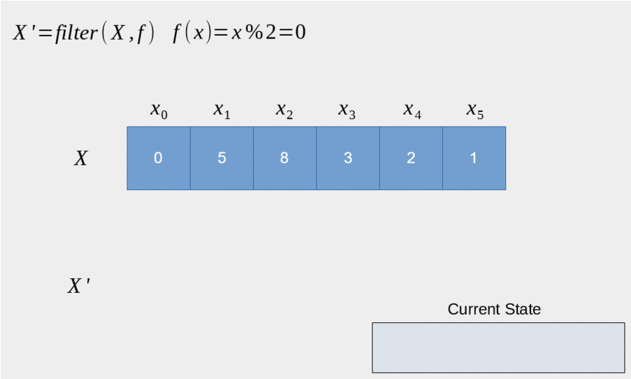
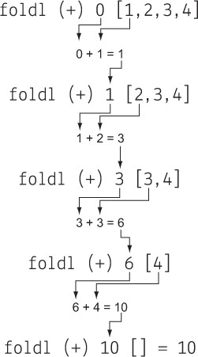

= C++模板元编程
:customcss: ../presentation.css
:revealjsdir: ../node_modules/reveal.js
:revealjs_plugins: ../presentation_plugins.js
:revealjs_plugins_configuration: ../presentation_plugins_conf.js
:revealjs_theme: serif
:highlightjs-theme: https://cdn.jsdelivr.net/npm/highlight.js@10.2.1/styles/atom-one-light.css
:highlightjs-languages: cpp
:source-highlighter: highlightjs
:revealjs_history: true
:revealjs_pdfseparatefragments: false
:revealjs_transition: zoom
:revealjs_slideNumber: c/t
:revealjs_fragmentInURL: true
:icons: font
:stem:
罗能 {docdate} @Shanghai

[subtitle]#template <typename 😀>#

== 模板介绍

[%step]
* 起初为了支持泛型替代宏而设计的语法
* 类型安全，编译期提前检查错误
* 人们无意中发现可以用于 [red]*编译期* 计算
* 语言标准发展不断完善元编程体验

== 泛型算法 & 宏

[.fragment]
[source,cpp]
----
#define MAX(X, Y) (((X) > (Y)) ? (X) : (Y))
MAX(a++, b++) // (((a++) > (b++)) ? (a++) : (b++))
MAX(0, "123") // runtime error
----

[.fragment]
[source,cpp,subs="none"]
----
void qsort( void *ptr, size_t count, size_t size,
    int (*comp)(const <mark>void *</mark>, const <mark>void *</mark>) );
----

[.fragment]
[source,cpp]
----
int values[] = { 88, 56, 100, 2, 25 };
int cmpfunc (const void* a, const void* b) {
   return ( *(int*)a - *(int*)b );
}
qsort(values, 5, sizeof(int), cmpfunc);
----

=== 泛型算法 & 模板函数
[.fragment]
[source,cpp]
----
template<typename T>
T max(T&& a, T&& b) {
    return a > b ? a : b;
}
----

[.fragment]
[source,cpp]
----
max(0, "123"); // error: no matching function for call to 'max(int, const char [4])'
----

[.fragment]
[source,cpp]
----
template<class RandomIt, class Compare>
void sort(RandomIt first, RandomIt last, Compare comp);
----

[.fragment]
[source,cpp]
----
int values[] = { 88, 56, 100, 2, 25 };
std::sort(values, values + 5,  {
    return a < b;
});
----

=== 泛型容器 & 宏
[source,cpp]
----
// collection.h
struct Collection_ ## TYPE {
 TYPE *array; // <1>
 size_t size, n;
};

#ifdef INSTANCE // <2>
Collection_ ## TYPE make_Collection_ ## TYPE(size_t sz) {
    // ...
}
#endif
----
[.fragment]
<1> 类型参数 `TYPE`
<2> 实例化函数

=== 泛型容器 & 宏
[source,cpp]
----
// main.cpp
#define INSTANCE

#define TYPE int // <1>
#include "collection.h"
#undef TYPE

#define TYPE string // <1>
#include "collection.h"
#undef TYPE

int main() {
    Collection_int lstInt = make_Collection_int(5); // <2>
    Collection_double lstDouble = make_Collection_double(5);
}
----
[.fragment]
<1> 实例化类型 `Collection_int`, `Collection_string`
<2> 实例化成员函数

=== 泛型容器 & 模板
[source,cpp]
----
// collection.h
template <typename T> // <1>
class Collection {
    T* array;
    size_t size, n;
public:
    Collection(size_t sz) {
        // ...
    }
};

// main.cpp
int main() {
    Collection<int> lstInt(5); // <2>
    Collection<double> lstDouble(5); // <2>
}
----
[.fragment]
<1> 模板参数 `T`
<2> 实例化类型 `Collection<int>`, `Collection<double>`

== 零成本抽象
[quote, Bjarne Stroustrup, 'http://www.stroustrup.com/ETAPS-corrected-draft.pdf[Foundations of C++]']
____
C++ implementations obey the zero-overhead principle:
What you don’t use, you don’t pay for. And further: What you do use, you couldn’t hand code any better.
____

[.notes]
--
C++特性引进原则，得遵守不会带来额外开销，不论时间上还是空间上，都比程序猿自己实现类似的特性要好（至少不差）

然而RTTI和异常违背了这个原则，所以编译器都有开关关掉这特性。
--

== 元编程 & Metaprogramming

[%step]
* 编译器解析执行代码，并 *生成* 代码、数据
* 将运行时逻辑挪到编译时计算，实现零成本抽象
* 运行时拥有改变结构的能力，动静结合

=== 元编程 & 流派
[%step]
* https://www.youtube.com/watch?v=PJwd4JLYJJY[Constexpr all the things!]
* 模板元编程
* 两者结合

=== Constexpr all the things!

[.notes]
--
constexpr目前还不成熟，要求太高，C++20支持编译期分配内存后，就能增加使用面了，降低门槛。
--

[.columns]
=== 模板元编程
[.column]
--
运行时交互

[%step]
* 数值
* 对象
--

[.column]
--
编译时计算

[%step]
* 数值
* 类型
* 对象 (C++20)
--

=== 模板元编程
函数式编程范式

[%step]
* 无副作用纯函数
* 延迟计算
* 模式匹配

[.notes]
--
由最基本的函数，通过函数组合实现复杂逻辑
--

[.columns]
=== 模板元编程：数值计算
[.column]
--
计算Fibonacci数列: stem:[f(n) = f(n-1) + f(n-2)]
[.fragment]
[source,cpp]
----
template <size_t N> // <1>
struct Fibonacci {  // <2>
    constexpr static size_t value = // <3>
        Fibonacci<N - 1>::value +
        Fibonacci<N - 2>::value;
};

template <> struct Fibonacci<0> {   // <4>
    constexpr static size_t value = 0;
};

template <> struct Fibonacci<1> {   // <4>
    constexpr static size_t value = 1;
}

template<size_t N>
constexpr size_t Fibonacci_v = Fibonacci<N>::value; // <5>
----
--

[.column.is-one-third]
--
[.fragment]
<1> 模板元函数 [.blue]*输入* 参数N，`size_t` 表明输入参数为 [.blue]*值*
<2> 模板元函数名 `Fibonacci`
<3> 模板元函数 [.blue]*输出* 返回 [.blue]*值* `value`
<4> 模式匹配，函数递归的边界条件
<5> 别名，方便调用

[.fragment]
icon:question[role="orange"]
如何调用

[.fragment]
[source,cpp]
----
Fibonacci<10>::value // 55
Fibonacci_v<10> // 55
----

[.fragment]
TIP: 1. 约定 [.blue]*尖括号* 为模板元函数F调用，`value` 作为函数的 [.blue]*返回值* +
2. 模板元函数名后缀 `_v` 为其别名: `F_v<IN>` ，避免写一长串 `F<IN>::value` 的烦恼
--

[.columns]
=== 模板元编程：类型计算
[.column]
--
计算类型 `T` 的指针类型 `T*`
[.fragment]
[source,cpp]
----
template <typename T> // <1>
struct AddPointer {   // <2>
    using type = T*;  // <3>
};

template <typename T>
using AddPointer_t =
    typename AddPointer<T>::type; // <4>
----
[.fragment]
<1> 模板元函数 [.blue]*输入* 类型T，`typename` 表明输入参数是 [.blue]*类型*
<2> 模板元函数名
<3> 模板元函数 [.blue]*输出* 返回 [.blue]*类型* `type`
<4> 别名，方便调用
--

[.column]
--

[.fragment]
icon:question[role="orange"]
如何调用

[.fragment]
[source,cpp]
----
typename AddPointer<int>::type px =
    new int{5};
AddPointer_t<int> px2 = new int{5};
----

[.fragment]
TIP: 1. 约定 [.blue]*尖括号* 为模板元函数F调用，`type` 作为函数的 [.blue]*返回类型* +
2. 模板元函数名后缀 `_t` 为其别名: `F_t<IN>` ，避免了写一长串 `typename F<IN>::type` 的烦恼
--

== 模板元编程：基础数据类型
[.fragment]
复合数据类型：TypeList

[%step]
* 输入多个 *类型* 参数：T1, T2, ...
* 输出一个 TypeList 类型

[.fragment]
[source,cpp]
----
template <typename ...Ts> // <1>
struct TypeList {
    using type = TypeList<Ts...>; // <2>
    constexpr static size_t size = sizeof...(Ts); // <3>
};
----

[.fragment]
<1> 输入参数，...Ts [.blue]#模板参数包# 声明，表示接收任意多的类型参数： T1, T2, T3, ...
<2> 输出类型，Ts... 表示展开 [.blue]#模板参数包#，展开后为T1, T2, T3, ...
<3> 列表长度，`sizeof...` 操作符求参数包个数

=== TypeList
基本操作

[%step]
* 向TypeList尾部插入一些类型: `append`
* 类型参数转发: `exportTo`
* 判断当前类型是否为 TypeList: `IsTypeList`
* 判断类型是否在TypeList中: `Elem`
* 高阶函数
** `Map`
** `Filter`
** `Fold`

=== append
向TypeList尾部插入一些类型

[.fragment]
[source,cpp]
----
template <typename ...Ts>
struct TypeList {
  template <typename ...T> // <1>
  using append = TypeList<Ts..., T...>; // <2>
};
----

[.fragment]
<1> 输入一些需要插入的类型参数 `T...`
<2> 输出插入类型之后的TypeList

[.fragment]
icon:question[role="orange"]
如何调用

[.fragment]
[source,cpp]
----
TypeList<int, char>::append<long, double> // TypeList<int, char, long, double>
----

=== exportTo
类型参数转发

[.fragment]
将 `TypeList<Ts...>` 参数转发至其他模板类，例如转成： `std::tuple<Ts...>`

[.fragment]
[source,cpp]
----
template <typename ...Ts>
struct TypeList {
    template <template<typename...> typename T> // <1>
    using exportTo = T<Ts...>; // <2>
};
----

[.fragment]
<1> 输入一个模板类 T
<2> 输出转发类型参数后的模板类 T<Ts...>

[.fragment]
NOTE: `template<typename ...> typename T` 表示模板类 `T` 接收可变类型参数

[.fragment]
icon:question[role="orange"]
如何调用

[.fragment]
[source,cpp]
----
TypeList<int, char>::exportTo<std::tuple> // std::tuple<int, char>
TypeList<int, char>::exportTo<std::variant> // std::variant<int, char>
----

=== IsTypeList
判断当前类型是否为 TypeList

[.fragment]
[source,cpp]
----
template<typename IN> // <1>
struct IsTypeList {
    constexpr static bool value = false; // <2>
};

template<typename ...Ts>
struct IsTypeList<TypeList<Ts...>> { // <3>
    constexpr static bool value = true;
};

template<typename IN>
constexpr bool IsTypeList_v = IsTypeList<IN>::value;
----

[.fragment]
<1> 输入类型参数 IN
<2> 默认认为该类型不是TypeList
<3> 模式匹配，当类型参数IN和TypeList类型一致时，返回 true

[.fragment]
icon:question[role="orange"]
如何调用

[.fragment]
[source,cpp]
----
IsTypeList_v<int>; // false
IsTypeList_v<TypeList<int>>; // true
----

=== Elem
判断类型是否在TypeList中
[.fragment]
[source,cpp]
----
template<typename IN, typename E> // <1>
struct Elem {
    static constexpr bool value = false; // <2>
};

template<typename E, typename ...Ts>
struct Elem<TypeList<Ts...>, E> {
    static constexpr bool value = (std::is_same_v<E, Ts> || ...); // <3>
};

template<typename IN, typename E>
constexpr bool Elem_v = Elem<IN, E>::value;
----

[.fragment]
<1> 输入两个类型参数：IN, E
<2> 默认认为E不存在于IN中
<3> 模式匹配，若IN类型为TypeList，则其一个个类型与E匹配

[.fragment]
icon:question[role="orange"]
如何调用

[.fragment]
[source,cpp]
----
Elem_v<TypeList<int>, int>; // true
Elem_v<TypeList<int>, float>; // false
----

== 高阶函数
数学和计算机科学定义如下高阶函数：

[.fragment]
* 输入的参数为函数
* 输出的参数为函数

[.fragment]
常用到的有：

[.fragment]
.Sort
[source,cpp]
----
template< class RandomIt, class Compar>
void sort(RandomIt first, RandomIt last,
    Compare comp); // <1>
----

[.fragment]
<1> sort为高阶函数，其输入参数为 `comp` 函数

=== Map高阶函数

* 输入一个列表和函数 f
* 输出对列表中的每个元素进行f函数调用后的列表

[.fragment]
image::Mapping-steps-loillibe-new.gif[100%,80%]

=== Filter高阶函数

* 输入一个列表和谓词函数P
* 对列表中的每个元素进行过滤操作，输出只保留谓词函数为真的元素的列表

[.fragment]

[.columns]
=== Fold高阶函数
[.column]
--
* 输入一个列表，二元函数f，和初值init
* 输出一个元素，结果为列表每个元素与二元函数递归调用后的结果
--

[.column.is-one-third]
--
[.fragment]

--

== 高阶函数
[quote, Conor Hoekstra, 'https://github.com/codereport/Talks/raw/master/2020-09-CppCon/SICP/Structure%20and%20Interpretation%20of%20Computer%20Programs%20-%20SICP.pdf[Structure and Interpretation of Computer Programs - SICP]']
____
Richard Waters (1979) developed a program that automatically analyzes traditional Fortran programs, viewing them in terms of *maps*, *filters*, and *accumulations*. He found that fully *90 percent* of the code in the Fortran Scientific Subroutine Package fits neatly into this paradigm. One of the reasons for the success of Lisp as a programming language is that lists provide a standard medium for expressing ordered collections so that they can be manipulated using higher-order operations. The programming language APL owes much of its power and appeal to a similar choice. In APL all data are represented as arrays, and there is a universal and convenient set of generic operators for all sorts of array operations.
____

=== Map实现
[source.fragment, cpp]
----
template<typename IN, template <typename> class F> // <1>
struct Map; // <2>

template<template <typename> class F, typename ...Ts>
struct Map<TypeList<Ts...>, F> {
    using type = TypeList<typename F<Ts>::type...>; // <3>
};

template<typename IN, template <typename> class F>
using Map_t = typename Map<IN, F>::type;
----

[.fragment]
<1> 输入类型参数 IN 和 元函数 F
<2> 声明一个元函数Map
<3> 模式匹配当IN类型为TypeList时，对其每个 `Ts...` 元素进行元函数调用

[.fragment]
NOTE: 1. `template <typename> class F` 为元函数声明，表示该函数输入一个类型参数 +
2. `typename F<Ts>::type` 表示对元函数 F 调用，输入一个类型参数 `Ts`，返回调用后的类型参数 `::type` +
3. `typename F<Ts>::type...` 展开后结果为 `typename F<T1>::type, typename F<T2>::type, typename F<T3>::type, ...`

=== Filter实现
[source.column.fragment,cpp]
----
template<typename IN, template <typename> class P, typename OUT = TypeList<>> // <1>
struct Filter {
    using type = OUT; // <2>
};

template<template <typename> class P, typename OUT, typename H, typename ...Ts>
class Filter<TypeList<H, Ts...>, P, OUT> {
    using tails = TypeList<Ts...>; // <3>
public:
    using type = typename std::conditional_t<P<H>::value, // <4>
          Filter<tails, P, typename OUT::template append<H>>,
          Filter<tails, P, OUT>>::type;
};

template<typename IN, template <typename> class P>
using Filter_t = typename Filter<IN, P>::type;
----

[.fragment]
<1> 输入类型参数 IN 和 谓词函数 P
<2> 默认返回类型为空 TypeList; 列表为空时递归终止返回当前 OUT TypeList
<3> 模式匹配当类型参数 IN 为 *非空* TypeList时，`tails` 取除了第一个元素后剩下元素组成的TypeList
<4> 对当前列表第一个参数 H 进行 P 函数调用，根据真假判断要不要把结果放到 OUT TypeList

[.fragment]
NOTE: 1. Filter实现采用了尾递归方式，可能有助于编译器提高编译速度 +
2. `P<H>::value` 表示对元函数P的调用，输入一个类型参数 H，输出其布尔值 `::value` +
3. 对 OUT TypeList进行append参数 H，因为 `append` 也是个模板元函数，嵌套于类TypeList中，需要写成 `typename OUT::template append<H>` ，可以看成是 `out.append(h)` 形式

=== Fold实现
[source.column.fragment,cpp]
----
template<typename IN, typename INIT, template<typename, typename> class OP> // <1>
struct Fold { using type = INIT; }; <2>

template<typename IN, typename INIT, template<typename, typename> class OP>
using Fold_t = typename Fold<IN, INIT, OP>::type;

template<typename ACC, template<typename, typename> class OP,
    typename H, typename ...Ts>
struct Fold<TypeList<H, Ts...>, ACC, OP> {
    using type = Fold_t<TypeList<Ts...>, typename OP<ACC, H>::type, OP>; // <3>
};
----

[.fragment]
<1> 输入类型参数 IN，初始类型参数 INIT, 二元函数 OP
<2> 默认返回初值；列表为空时递归终止返回当前 INIT 参数
<3> 对当前参数 H 执行二元函数 OP, 其返回类型更新 INIT 参数

[.fragment]
NOTE: 1. `template <typename, typename> class OP` 为元函数声明，两个 `typename` 说明该函数输入两个类型参数 +
2. `typename OP<ACC, H>::type` 表示对元函数 OP 调用，输入两个类型参数 ACC, H ，返回调用后的类型参数 `::type`

== TypeList实战

* 连接两个TypeList: `Concat`
* 快速排序: `QuickSort`
* 求图全局最短路径，动静结合

== Concat
连接两个TypeList: `Concat`

[.fragment]
[source,cpp]
----
template<typename IN, typename IN2> // <1>
class Concat {
    template<typename ACC, typename E> // <2>
    struct Append {
        using type = typename ACC::template append<E>;
    };
public:
    using type = Fold_t<IN2, IN, Append>; // <3>
};

template<typename IN, typename IN2>
using Concat_t = typename Concat<IN, IN2>::type;
----

[.fragment]
<1> 输入两个TypeList: IN, IN2
<2> Append 二元操作输入两个参数，一个 ACC TypeList，一个类型参数 E，通过调用TypeList的 `append` 元函数
<3> Fold 高阶函数调用，输入 IN2，初值IN，二元操作 Append，对IN2 TypeList的每个元素进行 Append 调用

[.fragment]
icon:question[role="orange"]
如何调用

[.fragment]
[source,cpp]
----
Concat_t<TypeList<int, char>, TypeList<float>> // TypeList<int, char, float>
----

=== Concat 2
icon:question[role="orange"]
有没有其他解法

[.fragment]
[source,cpp]
----
template<typename IN, typename IN2>
struct Concat;

template<typename ...Ts, typename ...Ts2>
struct Concat<TypeList<Ts...>, TypeList<Ts2...>> { // <1>
    using type = TypeList<Ts..., Ts2...>; // <2>
};

template<typename IN, typename IN2>
using Concat_t = typename Concat<IN, IN2>::type;
----

[.fragment]
<1> 模式匹配两个TypeList，得到各自模板参数包 Ts, Ts2
<2> 结果为两个TypeList的参数包都展开后放到一起

=== Concat 3
icon:question[role="orange"]
还有没有其他解法

[.fragment]
[source,cpp]
----
template<typename IN, typename IN2>
struct Concat {
    using type = typename IN2::template exportTo<IN::template append>; // <1>
};

template<typename IN, typename IN2>
using Concat_t = typename Concat<IN, IN2>::type;
----

[.fragment]
<1> 使用参数转发函数exportTo，将IN2的参数转发到IN的append函数上去

[.fragment]
NOTE: 1. 这里将exportTo当做高阶函数使用，其输入一个函数 IN::append，将自身的参数转调到这个函数上 +
2. 由于IN是模板类型参数，append 又是模板元函数，需要写成 `IN::template append`

== QuickSort

